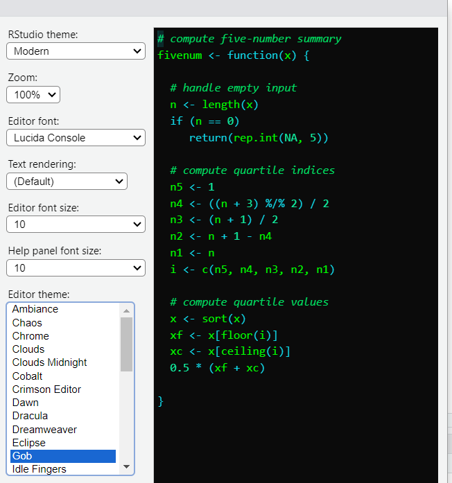

```{=html}
<style>
    body .main-container {
        max-width: 1200px;
    }
</style>
```

```{r setup, include=FALSE}
knitr::opts_chunk$set(echo = TRUE)
knitr::opts_chunk$set(cache = T)
library(dplyr)
library(tidyr)
library(tidyverse)
library(gt)
library(knitr)
library(jsonlite)
library(tidyjson)
library(patchwork)
library(gtExtras)
```

# Miscellaneous projects whilst in waiting for eggNOG-mapper on hawk to iterate over all the accessions (2025-02-01 to 2025-02-16)

## Introduction

While i am waiting for eggnog to process all of those files, i figured i
should get on with other things that need doing. I created a summary
mindmap that can be found in tnunn_research -\> 04_images under the same
name as the title here. Many of these steps are in service of increasing
the transparancy of the opperation, so that when others view it, they
can have help to understand all the obscure files, and also so that i
can keep track in my head.

## Methods

I am not doing these tasks in any particular order, and some, for
example the literature reading will be a long-term process. This started
with my investigations into the 43gig vs 9gig problem, however, as that
is directly tied to the eggnog process, i will leave that in the above
section. I have also begun work on the "HELP.pptx" file that one can use
to lookup what files do and where they fit into the pipeline. I have
begun a new workbook titled NotebookA_literature_review.Rmd" where I
have begun putting notes about the first paper i am reading. I used
powershell to zip directories of fastas where these have been sent to
hawk already, to save space, these are the commands i used:

<code> $folders = @("batch_1", "batch_2", "batch_3")
foreach ($folder in \$folders) { \>\> Compress-Archive -Path ".\$folder"
-DestinationPath ".\$folder.zip" -Force \>\> Remove-Item -Path
".\$folder" -Recurse \>\> } </code>

I also did something similar on hawk, using the commands: <code> find ./
-maxdepth 1 -type d -name "GC*" -exec bash -c 'zip -r "\${1%/}.zip"
"\$1"' \_ {} ; rm -R "*\_annotations" </code>

I plan to dashboard

Before my meeting with Aaron tomorrow (2025-02-04) i wanted to do some
more sample heatmaps with different parameters, for example, the
comparison of difference exluding Sphingomonas and Pantoea, as they seem
to dominate the heatmap. I also, wanted to do an analysis of similarity,
as common genes could give me an idea of what "requirements" a bacteria
may need to have to live in the skin Microbiome.

::: {style="background-color:yellow;"}
📌 ?: TODO: I think there is a way to group by pathway using the "class"
of the pathway. I want to look into that too.
:::

I had a play around with the different aesthetic themes i could add to
the regular prototype heatmap. I used the keggrest package to pull down
metadata about each KEGG pathway from the KEGG website. I also added a
facet grid to the heatmap to group by "class" a classification system
found on the KEGG website.

## Results


These heatmaps are interesting, but using a heatmap to visualise
commonality is slightly odd. I will admit, the time is 21:46 and my
notebooking skills may not be the best right now. After my meeting with
Aaron, i rejigged the code and now have this:


It looks almost identical, but the scale is much more sane this time.


## Conclusions

The screen i am using is burning my eyes now i'm putting in more
consecutive hours, so i am changing the mode to "Gob", the "tools" tab
under global and appearance. I have chosen this dark mode purely for the
name Gob, i find it humorous.

# Analysis 1: full genera-to-genera comparison (2025-01-31 to 2025-02-\_\_)

## Introduction

Now that the pipeline is where i want it, all that is left to do is
download somewhere north of 500 more accessions, put them on hawk,
eggnog them and bring them down to be heatmapped.

## Methods

I started by creating a non-prototype version of
"NCBIfastacollectorprototype", called
[NCBIfastacollector.R](https://github.com/tobiasnunn/tnunn_research/blob/7dc52b5c9490c2174cb5271cea988ef9beafabf8/00_scripts/Rscripts/NCBIfastacollector.R).
This is largely only different in so far as it includes filters based
around not repeating the fasta files i have already done. This is when i
ran into my first roadblock concerning how i create the control files
that feed my "slurmsquared.sh" file on hawk. Mainly, how to exclude the
fastas that have already been processed in a way that doesn't rely on a
file further down the pipeline. A possible solution i am going to try
later is downloading all of the fastas now, create all of the control
files now and then apart from the files done in the prototype i don't
have to do any exclusions. I separated "NCBIfastacollector" into it's
major components, this created the script "fasta_control_files.R". I
then modified this file so it would take outputs from the former (and a
few other earlier scripts) and cluster the accessions into output
directories i can then pass up to hawk, the aim is to create the control
script at the same time, but it is late and i could not get there today.
I decided to very quickly download the other 861 fastas and JSON files
needed for the intra-family analysis for Sphingomanadaceae and
Microbacteriaceae. This used the same methods i discussed previously for
the genera-genera comparison, but with a different filter on the source
list, the notation might be a bit spotty for this as i just wanted to
get it done, because i don't know if the page may go down due to "recent
events". For now, i have stored all of these in my personal onedrive,
again, for speed. I then got to work uploading the .fasta files to hawk,
with the partnered control file. Batch 1 is up. All of the control files
are up. I will add more as space becomes available.

I ran into quite the peculiar thing, i set the memory on hawk to 45gig
because when I used "seff" to look at slurm jobs it told me that the
jobs used 43 gig, however, i have done it a lot again today, and now it
tells me that the jobs take under 9 gigs. I had a look at the previous
ones and they still say 43 gigs so maybe there was some error in the
code or a variable i had taken out or maybe just random chance i hit a
bad one, anyway, i am going to need to update the script for the next
batch to only ask for 10 gigs because 8% efficiency is kind of
ridiculous, very odd. I set off batch 21 on hawk with some reduced
parameters as a bit of a test, 21 is the final batch with only two
samples so if something stupid happens then i have only lost one hour of
slurm time. It could end up scheduling them faster because they are now
seemingly less intensive, but this does raise the question, what happens
if one randonmly goes back to 40 gigs? i suppose it just means more will
fail and have to be redone, all i can really do here is cross my
fingers. Well, that was an abject failure, both crashed due to too
little memory, bananas as "seff" said they were still under budget, so
now i am thinking it can not be trusted and i am going back to the
original parameters, i am just going to have to accept that when its
busy there will be no parallel action and they are sometimes going to
take an age to schedule, because whenever i try reducing the parameters,
something stupid happens.

On Sunday, batches 2,3 and 4 were done in good time. On some occasions i
even saw hawk running 4 of my jobs at a time.

By the 15th of February all the batches were done and i was ready to run
them through the pipeline. Sometimes jobs would take an hour and a half
to run instead of 25 minutes, so i upped the limit to two hours, no idea
why this happens. I found that most progress is made on Sunday, not
unsurprising but very annoying from the perspective that basically
nothing can get done in the week due to hawk's encumberance. I need an
Anton:


I ran pipeline pt 1 and saw that 1 of the accessions had the
"assembly_status" "previous". Not sure what that means, but it seems too
insignificant to slow down for it after coming this far. Another thing
to note is that the methods for pt 2 are not wholly optimised for a
large load of files. A fun thing to see is that the output of pt 2
"mapids" is the object name in the file has 1,613,996 rows, which means
it could not fit in an excel document. If i was revising that script
again for the even larger family analysis, i would look for a way to
excise the for loop as they are not very performant.

I ran through all 4 stages, there are 4 now, modifying the code as
needed and doing testing. One such test concerned the genera grouping
proportion. Basically, microbacterium and sphingomonas have roughly 5
times the amount of accessions than any of the other groups, so it could
cause bias toward them in the heatmaps, so i ran an experiment where i
created a proportioned heatmap, where before i took the rowise
proportion for a map ID i took the "columnwise"(not actually per column
but per genera which were the columns) proportion by dividing by the
total number of accessions sampled. I then created a control that did
not do that to see what differences this would cause, this created
figures 5 and 6. As i did with the prototype, i decided to try removing
Sphingomonas and Pantoea as they dominate the heatmap, this produced
figure 7.

## Results

PUT HEATMAP HERE


Comparison of Figures 5 and 6 reveal that despite assuming my changes
would have dramatic effects, many map Ids are shared across the
heatmaps. There are however some differences.


Interestingly, in this one, Microbacterium dominates, possibly implying
that Brevibacterium and Brachybacterium are closely related to each
other, and this causes their lack of representation in the above
heatmaps.

(and then also the table that explains all of the map ids, can i use the
KEGG API to help me there?)

(also: compare with prototype, are the map ids the same, are there
differences?)

## Conclusion

i showed them to Aaron, and he echoed my concerns that they look
slightly odd. NOTE: change the proportionising so the across is only a
filter (the reason these things look so weird is because even if 1
column only has 0.0001 in a cell, as long as the others are 0, that
column is 100%, aka. its too black and white due to bad code, my B.)

# Aaron's Wolbachia mini-project(c. 2025-02-18 to 2025-02-\_\_)

Im going to break format for this one as it doesnt really relate to my
work, it is just a favour im doing for Aaron about his paper hes trying
to publish, but he gave me Approval to write about it.

So, his requests can be broken into two pieces:

1.  eggnog 2 local samples, look for specific genes in the list of KEGG
    IDs
2.  do the gtdb-tk de-novo_wf to make some trees using data from the
    NCBI

ironic i know, the two things for his project are the two things ive
spent 80% of this project doing. Anyway, yesterday or the day
before(18th/19th) i uploaded the 2 samples he emailed me to hawk and
created modified versions of existing files to run them through
eggNOG-mapper/2.1.12. I did this twice because i wanted to test a run of
"metagenomic" instead of "genomic" just so i had both in case (this is
just a parameter one needs to feed into eggnog). Those are now waiting
review as i have to go back to the email to see what the paper-people
want to see. So i decided to start on the trees, this follows a similar
methodology to my first section of notebook 1 and the section after
this, another irony. i modified a slurm file to run the wolbachia, this
started about 15:50 2025-02-20. This will produce the tree file that i
can use to construct the phylograms, the code for that should be around
somewhere, ill have a look at "Notebook.Rmd" (NOTE: aint it cute how i
thought thered only be one, Aaron said ive done a "monster amount of
coding", is nice). Then ill try and upgrade them like i did for the
heatmaps, because im guessing if i did them before christmas there is
room for improvement, and these upgrades will then feed what i do in the
next section, again, ironic. Im putting all this in a .qmd (Quarto is
just the next version of Rmd, i dont know enough to know if it is a
direct improvememt, but i like it, fun name), called
"Aaron_Wolbachia_miniproj.qmd". This is so that he gets his outputs but
also the code i used for at least the direct tree and table making.

# GTDB-TK De-Novo phylogenetic trees (2025-02-05 to 2025-02-\_\_)

## Introduction

A while back, i ran GTDB-TK in order to give me a list of accessions i
needed to pull down from the NCBI website. This did output a tree, but i
wanted to focus on getting the heatmap processes done. Now i have time
whilst those are running to do this with all the bells and whistles.

## Methods

The file this section concerns is called
[gtdbtk.bac120.decorated.tree](https://github.com/tobiasnunn/tnunn_research/blob/b8afeeb154bc1fbec30221d48c1b31852d5534e7/02_middle-analysis_outputs/gtdbtk_stuff/20241224_de_novo_wf/gtdbtk.bac120.decorated.tree).
I want to read this file into R, cut it down so i have multiple trees
containing the Bangor-made accessions and modify it so that it has nice
aesthetics (for example colouring the nodes based on the accession's
status). This serves to identify the species of the Bangor samples at a
higher level of accuracy than my work in the summer.

## Results

## Conclusion


