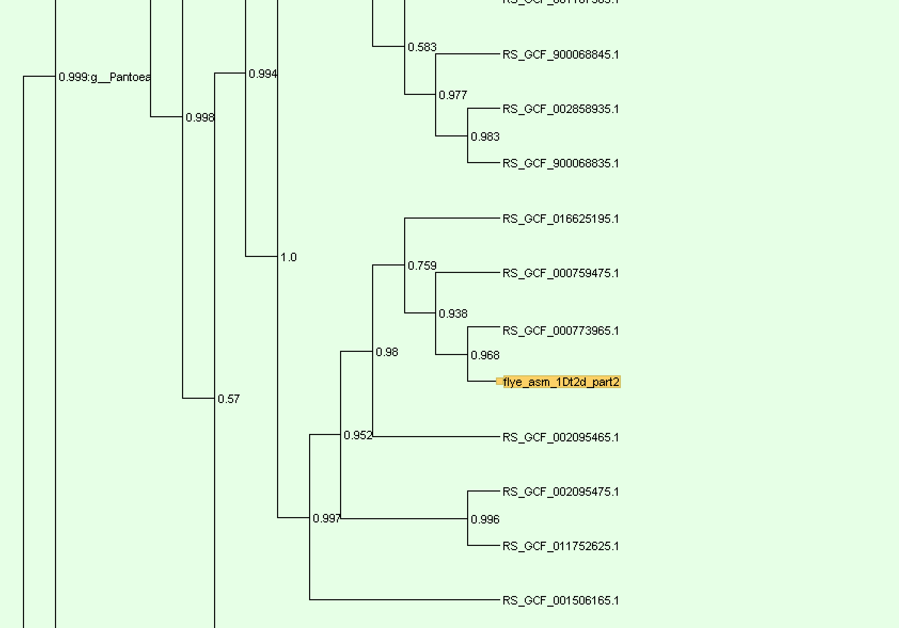

```{=html}
<style>
    body .main-container {
        max-width: 1200px;
    }
</style>
```

```{r setup, include=FALSE}
knitr::opts_chunk$set(echo = TRUE)
```

# 2024-12-24 de novo prelim

## Introduction

3 days ago i was looking through the gtdbtk manual and saw that `de_novo_wf` was an option for analysis to create the trees, from the description given:

```{r}
knitr::include_url("https://ecogenomics.github.io/GTDBTk/commands/de_novo_wf.html")
```

i beleived this would be something i should do as it might produce more accurate trees. sample `1Dt2d` *Enterobacter cancerogenus* had been placed by the `classify_wf` in the previous gtdbtk analysis in the genus *Pantoea*, which lead me to this search. after a bit of trial and error, i produced [this script](https://github.com/tobiasnunn/tnunn_research/blob/21f2fb071d76040dc82286b9399cb11ff11a3b3c/00_scripts/de_novo_gtdbtk.sh)

## Methods

This ran as a slurm job on hawk (SCW) from rougly 20:10 on the 23rd to 01:00 on the 24th, totalling 4 hours and 50 minutes. The main parameters that i experimented with were

```         
- #SBATCH --ntasks=5
- #SBATCH --time=24:00:00
- #SBATCH --mem=50g
- --cpus 10
```

I settled on these as being the "best", however, it is entirely possible that they could be more optimised.

## Results

This analysis produced these files:

```         
/scratch/scw2160/02_outputs/flye_asm/gtdb_tk_de_novo5/
.:
text.txt
ls
touch
list.txt
align
gtdbtk.bac120.decorated.tree
gtdbtk.bac120.decorated.tree-table
gtdbtk.log
identify
infer
gtdbtk.warnings.log

./align:
gtdbtk.bac120.msa.fasta.gz
gtdbtk.bac120.user_msa.fasta.gz
gtdbtk.bac120.filtered.tsv

./identify:
gtdbtk.ar53.markers_summary.tsv
gtdbtk.bac120.markers_summary.tsv
gtdbtk.translation_table_summary.tsv
gtdbtk.failed_genomes.tsv

./infer:
gtdbtk.bac120.decorated.tree
gtdbtk.bac120.decorated.tree-taxonomy
gtdbtk.bac120.decorated.tree-table
intermediate_results

./infer/intermediate_results:
gtdbtk.bac120.rooted.tree
gtdbtk.bac120.fasttree.log
gtdbtk.bac120.tree.log
gtdbtk.bac120.unrooted.tree
```

I then moved this `gtdbtk.bac120.decorated.tree` file into Dendroscope for review, all 10 are on one tree, but `1Dt2d` is still being placed in the "wrong" genus. on review of its [sister accession](https://www.ncbi.nlm.nih.gov/datasets/genome/GCF_000773965.1/) on the ncbi database.

## Conclusion

On the NCBI page for the sister accession, can be found a **CheckM** analysis that comes back with

> completeness: 90%\
> contamination: 3.6%\
> Taxonomy check status: failed

Upon viewing the tree in Dendroscope, the joining node has the label `0.968`. This I believe to be the probability the relationship is correct. this implies they are the same species, and the online sample is also identified as *Enterobacter cancerogenus*. However, due to the checkm analysis i find it plausible that they both have been misidentified and are in reality Pantoea species, i find this the most parsimonious explanation. I will follow this up with a CheckM analysis of my own on `1Dt2d`



------------------------------------------------------------------------

This was a "technical spike" or proof of concept for `de_novo_wf`

::: {style="background-color:yellow;"}
📌 TODO: do another Checkm analysis on 1Dt2d to see if the values are similar to the online sample
:::

# 2024-12-25 🎄 begginning of table, checkm

## Introduction

i wanted to see if the outputs of checkm differed from checkm2 so ran that on hawk. I also began recreating the innital table for metadata about the bangor samples, in the spirit of automation, a less manual approach was chosen this time around.

## Methods

using [this script](https://github.com/tobiasnunn/tnunn_research/blob/6be0be8a1de6b7fd64de79c280d9641f68a0e37c/00_scripts/checkmtest.sh) i ran a slurm job on hawk under the `lineage_wf` of CheckM for all 10 Bangor-made samples, this took just 4 minutes. I also worked on exporting the data i want to tabulate off of hawk. The **past** way i did this was by manually entering each file and noting down the important characteristics. However, because there are going to be more samples(and i wanted to be clever) i decided to use a more automated process. This was done by identifying different documents in the flye directories on hawk, specifically files called "assembly_info.txt" which contain the same information, but are vastly more exportable. These are stored here: cd /scratch/scw2160/02_outputs/flye_asm/flye_asm\_[accession]/ using [this script](https://github.com/tobiasnunn/tnunn_research/blob/6be0be8a1de6b7fd64de79c280d9641f68a0e37c/00_scripts/assemblytabledatagetter.sh) i exported them off of hawk.

## Results

the CheckM analysis produced [this output directory](https://github.com/tobiasnunn/tnunn_research/tree/0ce45bbddc271c477204cfc7c6d488a9d1d95a87/02_middle-analysis_outputs/CheckM). My export script exported all 10 "assembly_info.txt" files to a directory in my home directory, as well as adding their accession ID to the name, this is important as otherwise i wouldnt know which belonged to what accession. I then brought them down and stored them [here.](https://github.com/tobiasnunn/tnunn_research/tree/6be0be8a1de6b7fd64de79c280d9641f68a0e37c/05_projectdatabase/flyestuff)

## Conclusions

with it being christmas i did not take a serious look at the significance of the outputs of either, so that is what i plan to do next so that i can have some conclusions, maybe by the end of tomorrow. In conclusion, this process is only half done and will continue into the following entry(s).

::: {style="background-color:yellow;"}
📌 TODO: Complete analysis / processing of checkm and table stuff
:::

# 2024-12-27 finishing the table and checkm stuff, maybe extra if there is time

## Introduction

Basic stuff, finding out what i can do to the checkm analysis to turn it into publishable data, making the table using R scripts and the output files. exams in January are rapidly approaching, so i really do need to pick up the pace if i want to get this done before i begin revising. there is not a real goal for this exact piece, i just want to know how congruent the outputs from CheckM are to CheckM2.

## Methods

Using the [CheckM documentation](https://github.com/Ecogenomics/CheckM/wiki/Genome-Quality-Commands#qa). I found the output that i needed was [bin_stats_ext.tsv](https://github.com/tobiasnunn/tnunn_research/blob/0ce45bbddc271c477204cfc7c6d488a9d1d95a87/02_middle-analysis_outputs/CheckM/storage/bin_stats_ext.tsv). this is where the contamination(and a lot of other fun looking stats) are held. I can thusly import this file to R to try and extract usefull stuff / tabulate. Over the course of the day i developed and improved [CheckMtablegenerator.R](https://github.com/tobiasnunn/tnunn_research/blob/60126045c5802ef0627e86df57e7b533ff568e9d/00_scripts/CheckMtablegenerator.R). which creates the table layed out in results below. This uses a few packages, one of which was new to me, `gt`. This is a very useful package for table generation.

## Results

```{r, code = readLines("00_scripts/CheckMtablegenerator.R"), echo=FALSE, warning=FALSE, message=FALSE}

```

As mentioned, this table is a subset of the data, there was more outputted by CheckM, some of which overlaps with other analyses, but i did not know if it was relevent to include, so left it out, however, creating a new one with the omitted fields in would not be hard. This table will pair with one produced from CheckM2, because from what i've seen one is kind of an improvement on the other, but they kind of do different things, its confusing and thus why i want to do the comparison for future reference. I did not know what counted as "significantly complete", so arbitrarily placed the value at 90%. This analysis shows that 7 of the 10 samples are complete or near enough, with only 3 falling below my line. It should be noted that 2Dt1e, the lowest sample is only found to be 45% complete, this is a large outlier from the rest of the range. Contamination is fairly low in all, none above 3% and 3 samples on 0.00%.

## Conclusion

The main purpose of doing this is to compare with Checkm2, so im not sure what conclusions i can get from just this, other than many of the samples look sufficiently complete and i learned a fair amount from this experience. I think this will act as a good first step to compare future analysis against, for confirmation, as many upcoming analyses will give repeat data in some areas. Some of the field, for example "GC" are odd and i dont quite understand their significance, perhaps Aaron can give more info when he gets to this part of the notebook.

::: {style="background-color:yellow;"}
📌 TODO: finish the straight flye analysis / start on CheckM2
:::

# 2024-12-28 flye output tabulation and CheckM2 complete pipeline

## Introduction

Today i wanted to finish off the work from yesterday and start on CheckM2. this should produce two tables that i can use to compare with the first one from Checkm, maybe find out which method is superior?

## Methods

I created an R script, "rawflyeanalysis". Basic stuff, imports the text files i chose to download(i wonder if i could download the flye.log files and use a sub() to cut out the non-useful stuff). This then sorts and processes the data into the table seen below using a few packages. Just before lunch(11:45-ish) i set off the slurm job to run CheckM2 on hawk. Let's see how that goes after lunch, one thing of note though, i did make a minor modification, in the original file, i was running it on the fastas one at a time(?) weird, anyway, i changed it to work on the directory containing all 10, so it should do them all at once.

## Results

```{r, code = readLines("00_scripts/rawflyeanalysis.R"), echo=FALSE}

```

The basic flye output analysis produced this table, as mentioned, i couldn't get coverage to match what was on the flye.log file that i got the original of this table from, it is possible that file is the one that is wrong, but genome coverage is kind of all over the place, so i just omitted it as i don't think its one of the mandatory fields. I chose to sort the table by "Number of contigs" rather arbitrarily, but it does show something interesting in that why is there such a large range in fragment number?

## Conclusion

Thus far, i think that i got all of the fields in Table 2 in a more reliable format in Table 1, but with the quality checks as well, both tables suffer weirdness with "cov." and "GC" are they the same? are they both coverage? it is as mysterious as it is annoying. Let's see how they match up to CheckM2.

::: {style="background-color:yellow;"}
📌 TODO: pull down and link to runCheckM2TN.sh in the Rmd / something about pills / add link to rawflyeanalysis.R
:::
