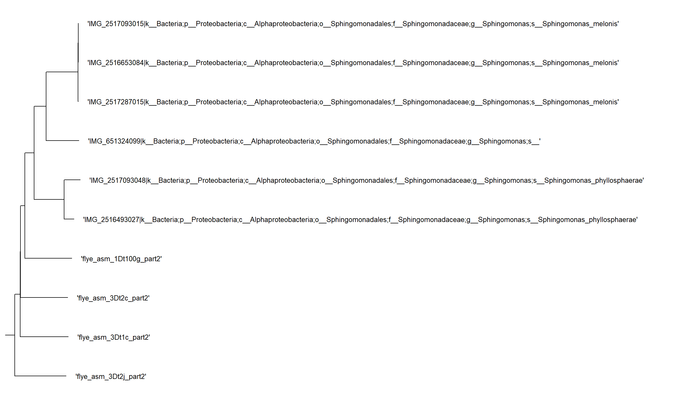
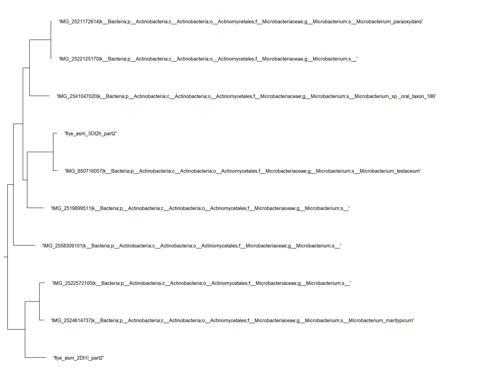
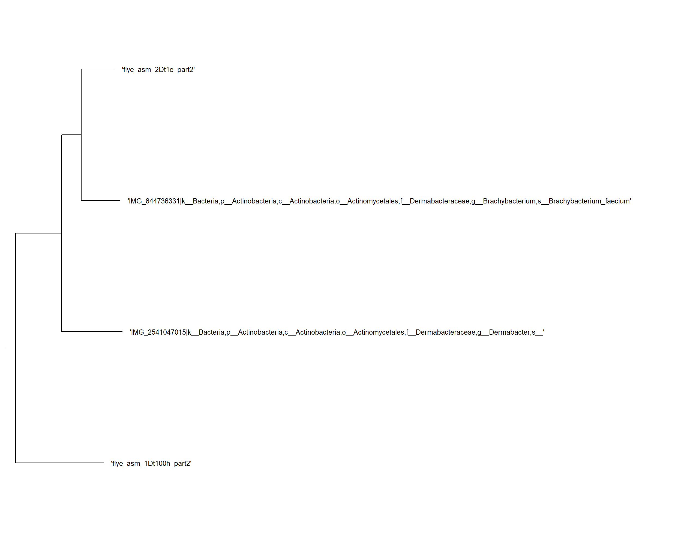
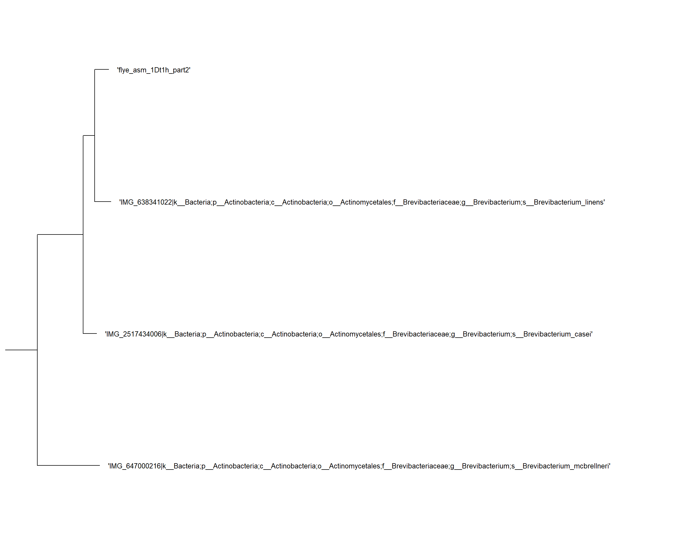
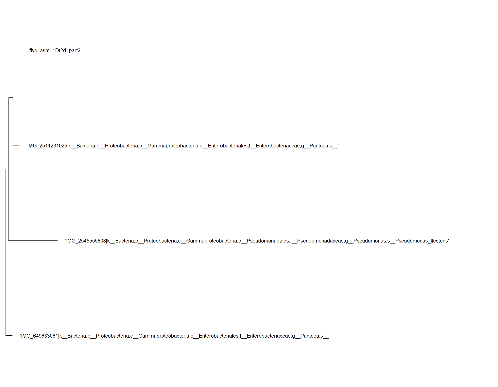

```{=html}
<style>
    body .main-container {
        max-width: 1200px;
    }
</style>
```

```{r setup, include=FALSE}
knitr::opts_chunk$set(echo = TRUE)
library(dplyr)
library(tidyr)
library(tidyverse)
library(gt)
```

# 2024-12-24 de novo prelim

## Introduction

3 days ago i was looking through the gtdbtk manual and saw that `de_novo_wf` was an option for analysis to create the trees, from the description given:

```{r}
knitr::include_url("https://ecogenomics.github.io/GTDBTk/commands/de_novo_wf.html")
```

i beleived this would be something i should do as it might produce more accurate trees. sample `1Dt2d` *Enterobacter cancerogenus* had been placed by the `classify_wf` in the previous gtdbtk analysis in the genus *Pantoea*, which lead me to this search. after a bit of trial and error, i produced [this script](https://github.com/tobiasnunn/tnunn_research/blob/21f2fb071d76040dc82286b9399cb11ff11a3b3c/00_scripts/de_novo_gtdbtk.sh)

## Methods

This ran as a slurm job on hawk (SCW) from rougly 20:10 on the 23rd to 01:00 on the 24th, totalling 4 hours and 50 minutes. The main parameters that i experimented with were

```         
- #SBATCH --ntasks=5
- #SBATCH --time=24:00:00
- #SBATCH --mem=50g
- --cpus 10
```

I settled on these as being the "best", however, it is entirely possible that they could be more optimised.

## Results

This analysis produced these files:

```         
/scratch/scw2160/02_outputs/flye_asm/gtdb_tk_de_novo5/
.:
text.txt
ls
touch
list.txt
align
gtdbtk.bac120.decorated.tree
gtdbtk.bac120.decorated.tree-table
gtdbtk.log
identify
infer
gtdbtk.warnings.log

./align:
gtdbtk.bac120.msa.fasta.gz
gtdbtk.bac120.user_msa.fasta.gz
gtdbtk.bac120.filtered.tsv

./identify:
gtdbtk.ar53.markers_summary.tsv
gtdbtk.bac120.markers_summary.tsv
gtdbtk.translation_table_summary.tsv
gtdbtk.failed_genomes.tsv

./infer:
gtdbtk.bac120.decorated.tree
gtdbtk.bac120.decorated.tree-taxonomy
gtdbtk.bac120.decorated.tree-table
intermediate_results

./infer/intermediate_results:
gtdbtk.bac120.rooted.tree
gtdbtk.bac120.fasttree.log
gtdbtk.bac120.tree.log
gtdbtk.bac120.unrooted.tree
```

I then moved this `gtdbtk.bac120.decorated.tree` file into Dendroscope for review, all 10 are on one tree, but `1Dt2d` is still being placed in the "wrong" genus. on review of its [sister accession](https://www.ncbi.nlm.nih.gov/datasets/genome/GCF_000773965.1/) on the ncbi database.

## Conclusion

On the NCBI page for the sister accession, can be found a **CheckM** analysis that comes back with

> completeness: 90%\
> contamination: 3.6%\
> Taxonomy check status: failed

Upon viewing the tree in Dendroscope, the joining node has the label `0.968`. This I believe to be the probability the relationship is correct. this implies they are the same species, and the online sample is also identified as *Enterobacter cancerogenus*. However, due to the checkm analysis i find it plausible that they both have been misidentified and are in reality Pantoea species, i find this the most parsimonious explanation. I will follow this up with a CheckM analysis of my own on `1Dt2d`


------------------------------------------------------------------------

This was a "technical spike" or proof of concept for `de_novo_wf`

::: {style="background-color:yellow;"}
📌 TODO: do another Checkm analysis on 1Dt2d to see if the values are similar to the online sample
:::

# 2024-12-25 🎄 beginning of table, checkm

## Introduction

i wanted to see if the outputs of checkm differed from checkm2 so ran that on hawk. I also began recreating the innital table for metadata about the bangor samples, in the spirit of automation, a less manual approach was chosen this time around.

## Methods

using [this script](https://github.com/tobiasnunn/tnunn_research/blob/6be0be8a1de6b7fd64de79c280d9641f68a0e37c/00_scripts/checkmtest.sh) i ran a slurm job on hawk under the `lineage_wf` of CheckM for all 10 Bangor-made samples, this took just 4 minutes. I also worked on exporting the data i want to tabulate off of hawk. The **past** way i did this was by manually entering each file and noting down the important characteristics. However, because there are going to be more samples(and i wanted to be clever) i decided to use a more automated process. This was done by identifying different documents in the flye directories on hawk, specifically files called "assembly_info.txt" which contain the same information, but are vastly more exportable. These are stored here: cd /scratch/scw2160/02_outputs/flye_asm/flye_asm\_[accession]/ using [this script](https://github.com/tobiasnunn/tnunn_research/blob/6be0be8a1de6b7fd64de79c280d9641f68a0e37c/00_scripts/assemblytabledatagetter.sh) i exported them off of hawk.

## Results

the CheckM analysis produced [this output directory](https://github.com/tobiasnunn/tnunn_research/tree/0ce45bbddc271c477204cfc7c6d488a9d1d95a87/02_middle-analysis_outputs/CheckM). My export script exported all 10 "assembly_info.txt" files to a directory in my home directory, as well as adding their accession ID to the name, this is important as otherwise i wouldnt know which belonged to what accession. I then brought them down and stored them [here.](https://github.com/tobiasnunn/tnunn_research/tree/6be0be8a1de6b7fd64de79c280d9641f68a0e37c/05_projectdatabase/flyestuff)

## Conclusions

with it being christmas i did not take a serious look at the significance of the outputs of either, so that is what i plan to do next so that i can have some conclusions, maybe by the end of tomorrow. In conclusion, this process is only half done and will continue into the following entry(s).

::: {style="background-color:yellow;"}
📌 TODO: Complete analysis / processing of checkm and table stuff
:::

# 2024-12-27 finishing the table and checkm stuff, maybe extra if there is time

## Introduction

Basic stuff, finding out what i can do to the checkm analysis to turn it into publishable data, making the table using R scripts and the output files. exams in January are rapidly approaching, so i really do need to pick up the pace if i want to get this done before i begin revising. there is not a real goal for this exact piece, i just want to know how congruent the outputs from CheckM are to CheckM2.

## Methods

Using the [CheckM documentation](https://github.com/Ecogenomics/CheckM/wiki/Genome-Quality-Commands#qa). I found the output that i needed was [bin_stats_ext.tsv](https://github.com/tobiasnunn/tnunn_research/blob/0ce45bbddc271c477204cfc7c6d488a9d1d95a87/02_middle-analysis_outputs/CheckM/storage/bin_stats_ext.tsv). this is where the contamination(and a lot of other fun looking stats) are held. I can thusly import this file to R to try and extract usefull stuff / tabulate. Over the course of the day i developed and improved [CheckMtablegenerator.R](https://github.com/tobiasnunn/tnunn_research/blob/60126045c5802ef0627e86df57e7b533ff568e9d/00_scripts/CheckMtablegenerator.R). which creates the table layed out in results below. This uses a few packages, one of which was new to me, `gt`. This is a very useful package for table generation, [here is some info](https://gt.rstudio.com/).

## Results

### Table 1: CheckM analysis

```{r checkm, echo=FALSE, warning=FALSE}
checkm <- read.csv("03_final_outputs/metadata_and_quality_tables/checkm.csv")
columnnames <- c("accession", "marker.lineage","Completeness", "Contamination","GC","GC.std", "Genome.size", "contigs", "Longest.contig", "Coding.density", "predicted.genes")
checkm[columnnames] %>%
  arrange(desc(Completeness)) %>%
  gt() %>%
  fmt_number(
    columns = c(Completeness, Contamination),
    decimals = 2,
    use_seps = TRUE) %>%
  fmt_percent(
    columns = c(GC, `GC.std`, `Coding.density`),
    decimals = 3,
    use_seps = TRUE) %>%
  fmt_number(
    columns = c(`Genome.size`, `predicted.genes`, `Longest.contig`),
    decimals = 0,
    use_seps = TRUE) %>%
  tab_source_note(source_note = "Source: CheckM lineage_wf performed on 2024-12-25") %>%
  opt_row_striping() %>%
  opt_stylize(style = 5, color = "blue") %>%
  data_color(
    columns = Completeness,
    method = "numeric",
    palette = "Blues",
    domain = c(90, 100),
    reverse = FALSE
  ) %>%
   data_color(
    columns = Contamination,
    method = "numeric",
    palette = "Oranges",
    domain = c(0, 3),
    reverse = FALSE
  ) %>%
  tab_header(
    title = "Table 1 - subset of data obtained from CheckM analysis",
    subtitle = md("of samples taken from the skin microbiome of *Dendrobates tinctorius*, including metrics of quality.")
    ) %>% 
  cols_label(marker.lineage = "Marker lineage",
         GC.std = "GC std",
         Genome.size = "Genome size",
         Longest.contig = "Longest contig",
         Coding.density = "Coding density",
         predicted.genes = "Predicted genes",
         accession = "Accession")
   
```

As mentioned, this table is a subset of the data, there was more outputted by CheckM, some of which overlaps with other analyses, but i did not know if it was relevent to include, so left it out, however, creating a new one with the omitted fields in would not be hard. This table will pair with one produced from CheckM2, because from what i've seen one is kind of an improvement on the other, but they kind of do different things, its confusing and thus why i want to do the comparison for future reference. I did not know what counted as "significantly complete", so arbitrarily placed the value at 90%. This analysis shows that 7 of the 10 samples are complete or near enough, with only 3 falling below my line. It should be noted that 2Dt1e, the lowest sample is only found to be 45% complete, this is a large outlier from the rest of the range. Contamination is fairly low in all, none above 3% and 3 samples on 0.00%.

## Conclusion

The main purpose of doing this is to compare with Checkm2, so im not sure what conclusions i can get from just this, other than many of the samples look sufficiently complete and i learned a fair amount from this experience. I think this will act as a good first step to compare future analysis against, for confirmation, as many upcoming analyses will give repeat data in some areas. Some of the field, for example "GC" are odd and i dont quite understand their significance, perhaps Aaron can give more info when he gets to this part of the notebook.

::: {style="background-color:yellow;"}
📌 TODO: finish the straight flye analysis / start on CheckM2
:::

# 2024-12-28 flye output tabulation and CheckM2 complete pipeline

## Introduction

Today i wanted to finish off the work from yesterday and start on CheckM2. this should produce two tables that i can use to compare with the first one from Checkm, maybe find out which method is superior?

## Methods

The order i did the two main focuses in shifted greatly during the day, with me bouncing between flye and CheckM2 analyses, so this section will have subheaders for better readability

### Flye analysis 1: assembly_info.txt

I created an R script, "[rawflyeanalysis.R](https://github.com/tobiasnunn/tnunn_research/blob/aad7006d65994e391c8621132fd7fab3fbf53609/00_scripts/rawflyeanalysis.R)". Basic stuff, imports the text files i chose to download(i wonder if i could download the flye.log files and use a sub() to cut out the non-useful stuff). This then sorts and processes the data into the table seen below using a few packages, [Table 2: Assembly_info.txt].

### CheckM2: slurm job

Just before lunch(11:45-ish) i set off the slurm job to run CheckM2 on hawk. Let's see how that goes after lunch, one thing of note though, i did make a minor modification, in the original file, i was running it on the fastas one at a time(?) weird, anyway, i changed it to work on the directory containing all 10, so it should do them all at once. [run_checkm2TN.sh](https://github.com/tobiasnunn/tnunn_research/blob/aad7006d65994e391c8621132fd7fab3fbf53609/00_scripts/run_checkm2TN.sh).

### Flye analysis 2: flye.log

After lunch, firstly i went back to the flye.log analysis i wanted to do largely for posterity. This was horrifyingly complex due to the "complex" nature of the flye.log files. I did this by creating a modified copy of my assembly_info.txt file grabber shell script, called [flye.loggetter.sh](https://github.com/tobiasnunn/tnunn_research/blob/b5c2f08cd3b2b0110d531ca9b3305cdde62d0797/00_scripts/flye.loggetter.sh), using ctrl + h to find and replace instead of manually changing things. I added this to an existing output directory in my home section of hawk, which i exported using MobaXterm**(do i need to include a section on how i use MobaXterm?)** to my computer**.** This is the folder called [flyestuff](https://github.com/tobiasnunn/tnunn_research/tree/b5c2f08cd3b2b0110d531ca9b3305cdde62d0797/02_middle-analysis_outputs/flyestuff), which contains both the flye.log and the assembly_info.txt files for each accession, i grouped them as it seemed relevent for organisation and didnt hinder the coding process at all. The R file i used to tabulate this is [flyeloganalysis.R](https://github.com/tobiasnunn/tnunn_research/blob/b5c2f08cd3b2b0110d531ca9b3305cdde62d0797/00_scripts/flyeloganalysis.R). This produced [Table 3: Flye.log]

### CheckM2: R table generation

This started with doing `cd /scratch/scw2160/02_outputs/flye_asm/CheckM2_20241228` to see the outputs, the job took roughly half an hour, ending at 12:15 pm. Firstly, i copied the output directory to my home area, then once again used MobaXterm to bring it down to the git repo, [here.](https://github.com/tobiasnunn/tnunn_research/tree/b5c2f08cd3b2b0110d531ca9b3305cdde62d0797/02_middle-analysis_outputs/CheckM2_20241228) Then, i began work on the R file to turn the `quality_report.tsv` file. This file was formatted very well, so turning it into a table was very simple, done in [CheckM2tablegenerator.R.](https://github.com/tobiasnunn/tnunn_research/blob/b5c2f08cd3b2b0110d531ca9b3305cdde62d0797/00_scripts/CheckM2tablegenerator.R) This produced [Table 4: CheckM2]

Note: there were other outputs to CheckM2, they were very interesting, im going to make the next section about exploring that possiblity, but they dont relate to this analysis.

## Results

### Table 2: Assembly_info.txt

```{r assemblyinfo, echo=FALSE, warning=FALSE}
processedtable <- read.csv("03_final_outputs/metadata_and_quality_tables/assemblyinfo.csv")
processedtable %>%
  arrange(desc(number_of_contigs)) %>%
  gt() %>%
  fmt_number(
    columns = c(number_of_contigs, total_length, largest_fragment),
    use_seps = TRUE,
    drop_trailing_zeros = TRUE) %>%
  fmt_number(
    columns = c(mean_fragments),
    decimals = 2,
    use_seps = TRUE) %>%
  tab_source_note(source_note = "Source: assembly_info.txt files produced in flye_asm analysis, August 27th 2024") %>%
  opt_row_striping() %>%
  opt_stylize(style = 5, color = "blue") %>%
  data_color(
    columns = number_of_contigs,
    method = "numeric",
    palette = "Blues",
    domain = c(0, 200),
    reverse = FALSE
  ) %>%
  tab_header(
    title = "Table 2 - Data obtained from flye outputs",
    subtitle = md("of samples taken from the skin microbiome of *Dendrobates tinctorius*")
  ) %>%
  tab_footnote(
    footnote = md("coverage could not be calculated from this method as no result matched what was found in the *flye.log* files")
  ) %>%
  cols_label(accession = "Accession",
             number_of_contigs = "Number of contigs",
             total_length = "Total length",
             largest_fragment = "Largest fragment",
             mean_fragments = "Mean fragment length")

```

The basic flye output analysis produced this table, as mentioned, i couldn't get coverage to match what was on the flye.log file that i got the original of this table from, it is possible that file is the one that is wrong, but genome coverage is kind of all over the place, so i just omitted it as i don't think its one of the mandatory fields. I chose to sort the table by "Number of contigs" rather arbitrarily, but it does show something interesting in that why is there such a large range in fragment number?

### Table 3: Flye.log

```{r flyelog, echo=FALSE, warning=FALSE}
tablenames <- c("Total.length", "Fragments", "Fragments.N50", "Largest.frg", "Scaffolds", "Mean.coverage")
final <- read.csv("03_final_outputs/metadata_and_quality_tables/flyelog.csv")
final %>%
  arrange(desc(`Fragments`)) %>%
  gt() %>%
  fmt_number(
    columns = tablenames,
    use_seps = TRUE,
    decimals = 0)  %>%
  tab_source_note(source_note = "Source: flye.log files produced in flye_asm analysis, August 27th 2024") %>%
  opt_row_striping() %>%
  opt_stylize(style = 5, color = "blue") %>%
  data_color(
    columns = `Fragments`,
    method = "numeric",
    palette = "Blues",
    domain = c(0, 200),
    reverse = FALSE
  ) %>%
  tab_header(
    title = "Table 3 - Data obtained from flye.log outputs",
    subtitle = md("of samples taken from the skin microbiome of *Dendrobates tinctorius*")
  ) %>% 
  cols_label(accession = "Accession",
             Total.length = "Total length",
             Fragments.N50 = "Fragments N50",
             Largest.frg = "Largest fragment",
             Mean.coverage = "Mean coverage") |>
  cols_move(
    columns = Total.length,
    after = Fragments
  )
```

This is a table of the type of stuff i first collated in the Summer, it shares many similarities and cross overs with Table 2, neither have quality statistics, but both are metadata largely concerning the length and fragment, a marked difference is this one comes with a concrete value of coverage. Comparative analysis of them feels like a thing that would happen in the conclusion to this document.

### Table 4: CheckM2

```{r checkm2, echo=FALSE, warning=FALSE}
checkm2 <- read.csv("03_final_outputs/metadata_and_quality_tables/checkm2.csv")
checkm2 %>%
  arrange(desc(Completeness)) %>%
  gt()  %>%
  tab_source_note(source_note = "Source: CheckM2 predict performed on 2024-12-28") %>%
  opt_row_striping() %>%
  opt_stylize(style = 5, color = "blue") %>%
  data_color(
    columns = Completeness,
    method = "numeric",
    palette = "Blues",
    domain = c(90, 100),
    reverse = FALSE
  ) %>%
   data_color(
    columns = Contamination,
    method = "numeric",
    palette = "Oranges",
    domain = c(0, 3),
    reverse = FALSE
  ) %>%
  tab_header(
    title = "Table 4 - quality analysis from CheckM2",
    subtitle = md("based on samples taken from the skin microbiome of *Dendrobates tinctorius*")
  ) %>%
  cols_label(Name = "Accession",
             Completeness_Model_Used = "Completeness model used",
             Translation_Table_Used = "Translation table used",
             Additional_Notes = "Additional notes") %>%
  cols_width(
    Completeness_Model_Used ~ px(250)
  )
```

This is the table of CheckM2 analysis, there are many differences in which fields are produced, also, there appears to be differences in the values themselves for Completeness and Contamination, perhaps part of the comparitive analysis, done in the conclusion should be the date at which both were at, as older versions will probably have less accurate values, and this may cause the difference as genomics is a fast evolving field. A Noteable difference is that CheckM used an internal diamond database, whereas CheckM2 required me to download my own. Exact comparison will be conducted in the conclusion.

## Conclusion

Thus far, i think that i got all of the fields in Table 2 in a more reliable format in Table 1, but with the quality checks as well, both tables suffer weirdness with "cov." and "GC" are they the same? are they both coverage? it is as mysterious as it is annoying. Let's see how they match up to CheckM2. It is getting late, i think that tomorrow is going to be the comparitive analysis and then moving onto the fun-looking checkm2 stuff.

::: {style="background-color:yellow;"}
📌 ?: CONCLUSION: how do comparison of all 4 tables next to each other without creating a monstrocity of indented code / something about pills/ find date difference in version history between CheckM and CheckM2 comparitive analysis/
:::

# 2024-12-29 conclusion to tables + prelim investigations into funky checkm stuff

## Introduction

Due to this section being largely about the conclusion from the last week, the other sections may be light, as this is largely just a wrap up i was too tired to do yesterday.

## Methods

One thing that might be relevent to note is that i changed the Markdown file so that the tables generated above now come from .csv output files. This helps on cutting down the time taken to knit the document and means that there are not multiple instances of code across the document, as the results section down here will include all 4 tables in one form or another. (basically, this increases flexibility of how the data can be used). In order to find the version history for CheckM, i went here \_\_\_\_\_\_. For CheckM2, i went here \_\_\_\_\_\_ and looked at the comit history as the version on Hawk is a developer version, not one of the official release, beginning at \_\_\_\_.

## Results

### Comparison of CheckM and CheckM2

```{r m_vs_m2, echo=FALSE, warning=FALSE}
#----------------------combi table gen-------------------------------------
checkm <- read.csv("03_final_outputs/metadata_and_quality_tables/checkm.csv")
checkm2 <- read.csv("03_final_outputs/metadata_and_quality_tables/checkm2.csv")
names(checkm2)[names(checkm2) == "Name"] <- "accession"
combicheck <- merge(checkm, checkm2, by = "accession", all = TRUE)
#----------------------combi table product---------------------------------
columnnames <- c("accession", "Completeness.x", "Contamination.x", "Completeness.y", "Contamination.y")
combicheck[columnnames] %>%
  arrange(accession) %>%
  gt() %>%
  fmt_number(
    columns = c(Completeness.x, Contamination.x, Completeness.y, Contamination.y),
    decimals = 2,
    use_seps = TRUE)  %>%
  tab_source_note(source_note = md("Source:  
                  CheckM lineage_wf performed on 2024-12-25  
                  CheckM2 predict performed on 2024-12-28")) %>%
  opt_row_striping() %>%
  opt_stylize(style = 5, color = "blue") %>%
  data_color(
    columns = c(Completeness.x, Completeness.y),
    method = "numeric",
    palette = "Blues",
    domain = c(90, 100),
    reverse = FALSE
  ) %>%
   data_color(
    columns = c(Contamination.x, Contamination.y),
    method = "numeric",
    palette = "Oranges",
    domain = c(0, 3),
    reverse = FALSE
  ) %>%
  tab_header(
    title = "Table 5 - Comparison of quality metrics",
    subtitle = md("for the same fasta files between CheckM/1.1.3 and CheckM2/0.1.3")
     ) %>%
  tab_spanner(
    label = "CheckM/1.1.3",
    columns = c("Completeness.x", "Contamination.x")) %>%
  tab_spanner(
    label = "CheckM2/0.1.3",
    columns = c("Completeness.y", "Contamination.y")) %>%
  cols_label(Completeness.x = "Completeness",
         Completeness.y = "Completeness",
         Contamination.x = "Contamination",
         Contamination.y = "Contamination",
         accession = "Accession")
   
```

::: {style="background-color:yellow;"}
📌 ?: AFTER LUNCH: date the programs, do the comparison for the "raw"/ no package analyses. / look in log files for diamond version for M and M2
:::

### All tables {.tabset .tabset-pills}

#### Flye assembly

```{r chart-flye, ref.label = c('assemblyinfo'), echo=FALSE, warning=FALSE}

```

#### Flye log

```{r chart-flye-log, ref.label = c('flyelog'), echo=FALSE, warning=FALSE}

```

#### CheckM

```{r chart-checkm, ref.label = c('checkm'), echo=FALSE, warning=FALSE}

```

#### CheckM2

```{r chart-checkm2, ref.label = c('checkm2'), echo=FALSE, warning=FALSE}

```

###  {.unnumbered}

Table 5 is a direct comparison of each module's ability to calculate Completeness and Contamination for the same samples. Each column has a [data colourisation](https://gt.rstudio.com/reference/data_color.html), the scale for Completeness was 90-100%, so anything appearing in grey i consider "low quality", the scale for Contamination is 0-3%. Both analyses agree that 3 of the ten accessions (1Dt100g, 2Dt1e and 3Dt2h) do not meet the 90% threshold, and only slightly differ on exact value. 2Dt1e is of special note because it is the only sample below 50% completeness. All values of Completeness are roughly the same, with CheckM2 having slightly higher results across the board. This contrasts with the values of Contamination, in which values differ quite dramatically, with small results getting larger and large results getting smaller. This is seen most in the results for 2Dt1l, in which the CheckM contamination states 2.32%, but this falls sharply in CheckM2 to 0.27%, coincidentally this sample also sees a rise in Completeness from 98.82% to 100%, so perhaps different genes or sequences are differently classified between the two systems. Overall, Contamination is lower in CheckM2 than CheckM.

However, Completeness and Contamination are not the only fields that these modules produce. CheckM returns with a wide array of extra data about the samples (as well as the extra stuff i will discuss in the next section, if that path leads anywhere) including; taxonomy to the order level, accession 1Dt2d even got identified to the family level, as well as many metrics for fragment count and size. It is important to remember that as an undergraduate student i don't have a full understanding of all of these fields, and this is a subset of the data based upon what i thought was important. This contrasts with CheckM2 which outputs no additional data, however, it does include information about the "Completeness model" and "Translation table" used, which could be useful in fact-checking the results of the analysis.

A secondary analysis i wanted to perform was between the results of the CheckM analysis against that of the manual "assembly_info.txt" and "flye.log" analyses, as they all share overlaps and this could inform future reasearch as to which method is best so all do not need to be performed. All three agree on the number of contigs or fragments (which are either pseudonyms or used interchangeably), as well as the length of the genome and "largest fragment"/ "longest contig". This is where differences arise in what addition fields each method reveals. The assembly_info.txt files give the mean fragment length, though i am not sure how relevant this is. The flye.log files contain information on "N50", scaffolds and Mean coverage, i am not sure of the purpose of N50, scaffolds is only ever 0 for all, however mean coverage is perhaps a useful statistic only found in this analysis. Finally, CheckM contains information on "GC", which i first took to mean Genome Coverage, but upon viewing [this page](https://github.com/Ecogenomics/CheckM/wiki/Reported-Statistics#qa), i discovered meant the proportion of Guanine and Cytosine to Adenine and Thymine, thus GC. This page also contains useful definitions for other fields i did not include, and even some for CheckM2. Other extra fields include coding density and predicted genes, potentially useful.

## Conclusion

For the CheckM vs CheckM2 analysis, the version used for CheckM is older, version 1.1.3 was released on the [9th of July 2020](https://github.com/Ecogenomics/CheckM/releases/tag/v1.1.3), whereas version 0.1.3 of CheckM2 was created on the [18th of July 2022](https://github.com/chklovski/CheckM2/commit/aa62328615afd16e95b94b7a582d6cf08ddcd937). However, it should be noted both versions found on hawk are out of date from the modern, with the latest version of CheckM being 1.2.3, released on the [25th of June 2024](https://github.com/Ecogenomics/CheckM/tags) and the latest version of CheckM2 is version 1.0.2, released on the [19th of May 2023](https://github.com/chklovski/CheckM2/tags). It would appear that CheckM2 is not a replacement for CheckM, as CheckM is more up to date than CheckM2. Both used their own internal DIAMOND database, dating these is very difficult, so the age of the programs themselves is the only thing i have to go on.

From this information and my analysis of the tables i generated, i conclude that CheckM is the most useful analysis, returning the largest amount of information about a sample and being the most up-to-date. It is difficult to determine which of CheckM and CheckM2 give more reliable results for completeness and contamination, however, if the impact of the analysis had real world implications, i would run them both in parallel due to CheckM2's more focused nature, this should not add much time to the generation process as both are reletively quick and produce outputs easy to tabulate and analysise. I can confirm that CheckM is a good alternative to manually turning files in the Flye_asm output directories into tables, those ones entailed much difficulty to tabulate and contain less data. However, if there is a situation where coverage is mandatory, the flye.log file is the only one to give a reliable value.

In conclusion, i believe CheckM is the best overall analysis, giving results for all 3 extra analysis combined, in reference to CheckM2 they largely agree in all areas, but if my results had real world consequences i would run both for the conformation, though i can find no way of discerning which method is more accurate. Perhaps in future i can ask for the most modern versions of each to be downloaded to hawk and conduct a comparison on them then. My next projects will be conducted on areas around CheckM due to the discovery of graphical outputs and links to KO pathways, which i hope to yield interesting results. When term restarts i will have to discuss with Aaron the implications for this part of the study. i.e. what does the results of Completeness and contamination mean for our samples? or are these just things we want to know about them?

::: {style="background-color:yellow;"}
📌 TODO: (after conc of last bit) investigations into KO and protein stuff / just found out checkm is better documented and has some graph output options, so that is something to look into as well / tree_qa command (fun checkM stuff abound). / dendrogram?
:::

# 2024-12-30 / 2024-12-31 checkm tree_qa

## Introduction

In the [CheckM documentation](https://github.com/Ecogenomics/CheckM/wiki/Workflows#lineage-specific-workflow) for lineage_wf, there are 6 functions, 5 are categorised as M (Mandetory), however a 6th "checkm tree_qa" is marked as "R" and is stated to be optional, looking closer at [this function,](https://github.com/Ecogenomics/CheckM/wiki/Genome-Quality-Commands#tree_qa) it has 5 different potential outputs that look interesting, so i figured i would give it a go and see what i could get out of it, sort of exploratory.

## Methods

The vast majority of the code required was already used for the original checkm bash script, so i copied it and made the modifications, producing [this file.](https://github.com/tobiasnunn/tnunn_research/blob/3d90f340592d7081d3c6e172cbc786c8b85f368f/00_scripts/checkMtreeqa.sh) I could not figure out a way to run all 5 functions at once, so i had to go into the file and change the name (because these were all outputting to one place so naming the function was required to distinguish)and -o function(how to select the desired output) for each iteration. This was not an issue however as when run as a slurm job on hawk, none of the options took longer than 10 seconds to complete. In order to turn the output from option 2 into a table, i created [this R script](https://github.com/tobiasnunn/tnunn_research/blob/20d1f52225ae83ba449e471cd260ce62f92c4ed9/00_scripts/CheckMtreeqa.R), which outputs [this file.](https://github.com/tobiasnunn/tnunn_research/blob/20d1f52225ae83ba449e471cd260ce62f92c4ed9/03_final_outputs/metadata_and_quality_tables/checkmtreeqa.csv) I am not sure if i mentioned it above, but i found a way to do the formatting for my tables in this document, which frees up memory and reduces load times, by loading in a .csv of the cleaned data, instead of cleaning the data and doing the whole script in R, which also creates multiple instances. Basically, it was a whole thing, but now it is not a problem because of some clever coding.

[viewClade function](https://yulab-smu.top/treedata-book/chapter6.html?q=viewclade#viewing-selected-clade)

## Results

I created an [output directory](https://github.com/tobiasnunn/tnunn_research/tree/3d90f340592d7081d3c6e172cbc786c8b85f368f/02_middle-analysis_outputs/CheckM/checkmtreeqa) to store all the outputs. As mentioned, there were five; 2 are metadata tables which contain taxonomy data, one basic and one with more data. The next two are .tree files which place the samples in a tree with online references from the [IMG database](https://img.jgi.doe.gov/), one had the ID on that system, in the other the tip labels contained the full taxonomy of each sample. It is possible i can use these for a comparative analysis of CheckM and gtdbtk or ncbi and img. The fifth and final output is: "multiple sequence alignment of reference genomes and bins which can be used to infer a *de novo* genome tree". It looks to be a fasta file for proteins in each sequence, as of now im unsure what to do with it, i recognise de novo from gtdbtk, is there a link? i will have to consult Aaron for this one.

section finished on 2024-12-31

```{r chart-checkmtreeqa, echo=FALSE, warning=FALSE}
#---------------read in file--------------------------------
treeqa <- read.csv(file = "03_final_outputs/metadata_and_quality_tables/checkmtreeqa.csv")
#----------------table--------------------------
columnnames <- c("BinId", "Xuniquemarkersof43", "Taxonomycontained","Taxonomysisterlineage")
treeqa$Taxonomycontained <- gsub(";", "&#8594;", treeqa$Taxonomycontained)
treeqa$Taxonomysisterlineage <- gsub(";", "&#8594;", treeqa$Taxonomysisterlineage)
treeqa[columnnames] %>%
  gt() %>%
  tab_source_note(source_note = "Source: CheckM tree_qa performed on 2024-12-30") %>%
  opt_row_striping() %>%
  opt_stylize(style = 5, color = "blue") %>%
  tab_header(
    title = "Table 6 - subset of data obtained from secondary CheckM analysis",
    subtitle = md("of samples taken from the skin microbiome of *Dendrobates tinctorius*, including taxonomy at various levels")
  ) %>%
  fmt_markdown(
    columns = c(Taxonomycontained, Taxonomysisterlineage),
    rows = everything(),
    md_engine = "markdown"
  ) %>%
  cols_label(Xuniquemarkersof43 = "Unique Markers (of 43)",
         Taxonomycontained = "Taxonomy (Contained)",
         Taxonomysisterlineage = "Taxonomy (Sister Lineage)",
         BinId = "Accession") %>%
  data_color(
    columns = c(Xuniquemarkersof43),
    method = "numeric",
    palette = "Blues",
    domain = c(40, 43),
    reverse = FALSE) %>%
  tab_style(
    style = list(
      cell_text(size = "small")
      ), 
    locations = cells_body(
      columns = c(Taxonomycontained, Taxonomysisterlineage),
      rows = everything()
      )
    )
  
```

This is a subset of output 2 showing some taxonomic assignments for the samples, as well as "unique markers". 9 are above 40, with only 2Dt1e falling below at 32. Output 1 is a simplified version of Output 2, with the same main fields but missing some found in 2. As mentioned, this is a subset, due to space, and some difficulties in coding, i only took the unique fields. The output table also contained data on number of genes and fragment count, GC etc that is already shown in [Table 1: CheckM analysis]. As well as this, there were some extra fields focussing on the mean values of each field for the groupings each sample were in, i beleive this is the final value in "Taxonomy (Contained)", again because of space and relevance i cut them from the final product.

### Tree_qa Phylograms {.tabset .tabset-pills}

#### *Sphingomonas* samples



#### *Microbacterium* samples



#### *Brachybacterium /* Dermabactersample



#### *Brevibacterium* samples



#### *Pantoea* samples




###{-}

## Conclusion

Output 2, and to a lesser extent 1, present interesting data, it is not as useful as the data produced by the main analysis, but i think it was worth doing. It is possible i am not fully apreciating all of the outputs of this. Only very few of the samples get a taxonomy to the species level, however, it does confirm that sample 1Dt2d, marked "*Enterobacter cancerogenus*" by early taxonomic analysis actually belongs to the genus *Pantoea.* Confirming the analysis done all the way back in the technical spike for gtdbtk de novo [Conclusion].

I learned some new things vis a vis new functions to tabulate like changing text size and pruning/collapsing trees in R

::: {style="background-color:yellow;"}
📌 TODO: finish off the results for the phylos, talk about output 5 and then finish conc / investigations into KO and protein stuff / just found out checkm is better documented and has some graph output options, so that is something to look into as well / tree_qa command (fun checkM stuff abound). / dendrogram? / did i ever link to the gt() documentation? / ggtree heatmaps?
:::
