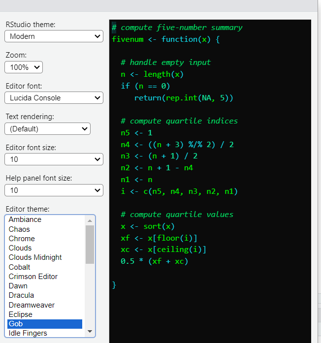

```{=html}
<style>
    body .main-container {
        max-width: 1200px;
    }
</style>
```

```{r setup, include=FALSE}
knitr::opts_chunk$set(echo = TRUE)
knitr::opts_chunk$set(cache = T)
library(dplyr)
library(tidyr)
library(tidyverse)
library(gt)
library(knitr)
library(jsonlite)
library(tidyjson)
library(patchwork)
library(gtExtras)
```

# Analysis 1: full genera-to-genera comparison (2025-01-31 to 2025-02-\_\_)

## Introduction

Now that the pipeline is where i want it, all that is left to do is
download somewhere north of 500 more accessions, put them on hawk,
eggnog them and bring them down to be heatmapped.

## Methods

I started by creating a non-prototype version of
"NCBIfastacollectorprototype", called
[NCBIfastacollector.R](https://github.com/tobiasnunn/tnunn_research/blob/7dc52b5c9490c2174cb5271cea988ef9beafabf8/00_scripts/Rscripts/NCBIfastacollector.R).
This is largely only different in so far as it includes filters based
around not repeating the fasta files i have already done. This is when i
ran into my first roadblock concerning how i create the control files
that feed my "slurmsquared.sh" file on hawk. Mainly, how to exclude the
fastas that have already been processed in a way that doesn't rely on a
file further down the pipeline. A possible solution i am going to try
later is downloading all of the fastas now, create all of the control
files now and then apart from the files done in the prototype i don't
have to do any exclusions. I separated "NCBIfastacollector" into it's
major components, this created the script "fasta_control_files.R". I
then modified this file so it would take outputs from the former (and a
few other earlier scripts) and cluster the accessions into output
directories i can then pass up to hawk, the aim is to create the control
script at the same time, but it is late and i could not get there today.
I decided to very quickly download the other 861 fastas and JSON files
needed for the intra-family analysis for Sphingomanadaceae and
Microbacteriaceae. This used the same methods i discussed previously for
the genera-genera comparison, but with a different filter on the source
list, the notation might be a bit spotty for this as i just wanted to
get it done, because i don't know if the page may go down due to "recent
events". For now, i have stored all of these in my personal onedrive,
again, for speed. I then got to work uploading the .fasta files to hawk,
with the partnered control file. Batch 1 is up. All of the control files
are up. I will add more as space becomes available.

I ran into quite the peculiar thing, i set the memory on hawk to 45gig
because when I used "seff" to look at slurm jobs it told me that the
jobs used 43 gig, however, i have done it a lot again today, and now it
tells me that the jobs take under 9 gigs. I had a look at the previous
ones and they still say 43 gigs so maybe there was some error in the
code or a variable i had taken out or maybe just random chance i hit a
bad one, anyway, i am going to need to update the script for the next
batch to only ask for 10 gigs because 8% efficiency is kind of
ridiculous, very odd. I set off batch 21 on hawk with some reduced
parameters as a bit of a test, 21 is the final batch with only two
samples so if something stupid happens then i have only lost one hour of
slurm time. It could end up scheduling them faster because they are now
seemingly less intensive, but this does raise the question, what happens
if one randonmly goes back to 40 gigs? i suppose it just means more will
fail and have to be redone, all i can really do here is cross my
fingers. Well, that was an abject failure, both crashed due to too
little memory, bananas as "seff" said they were still under budget, so
now i am thinking it can not be trusted and i am going back to the
original parameters, i am just going to have to accept that when its
busy there will be no parallel action and they are sometimes going to
take an age to schedule, because whenever i try reducing the parameters,
something stupid happens.

On Sunday, batches 2,3 and 4 were done in good time. On some occasions i even saw hawk running 4 of my jobs at a time.

## Results

PUT HEATMAP HERE

(and then also the table that explains all of the map ids, can i use the
KEGG API to help me there?)

(also: compare with prototype, are the map ids the same, are there
differences?)

## Conclusion

# Miscelaneous projects whilst in "eggnog limbo" (2025-02-01 to 2025_____)

## Introduction
While i am waiting for eggnog to process all of those files, i figured i should get on with other things that need doing. I created a summary mindmap that can be found in tnunn_research -> 04_images under the same name as the title here. Many of these steps are in service of increasing the transparancy of the opperation, so that when others view it, they can have help to understand all the obscure files, and also so that i can keep track in my head.

## Methods
I am not doing these tasks in any particular order, and some, for example the literature reading will be a long-term process. This started with my investigations into the 43gig vs 9gig problem, however, as that is directly tied to the eggnog process, i will leave that in the above section. I have also begun work on the "HELP.pptx" file that one can use to lookup what files do and where they fit into the pipeline. I have begun a new workbook titled NotebookA_literature_review.Rmd" where I have begun putting notes about the first paper i am reading. I used powershell to zip directories of fastas where these have been sent to hawk already, to save space, these are the commands i used:

<code>
$folders = @("batch_1", "batch_2", "batch_3")
foreach ($folder in $folders) {
>>     Compress-Archive -Path ".\$folder" -DestinationPath ".\$folder.zip" -Force
>>     Remove-Item -Path ".\$folder" -Recurse
>> }
</code>

I also did something similar on hawk, using the commands:
<code>
find ./ -maxdepth 1 -type d -name "GC*" -exec bash -c 'zip -r "${1%/}.zip" "$1"' _ {} \;
rm -R "*_annotations"
</code>

I plan to dashboard


The screen i am using is burning my eyes now i'm putting in more
consecutive hours, so i am changing the mode to "Gob", the "tools" tab
under global and appearance. I have chosen this dark mode purely for the
name Gob, i find it humorous.


