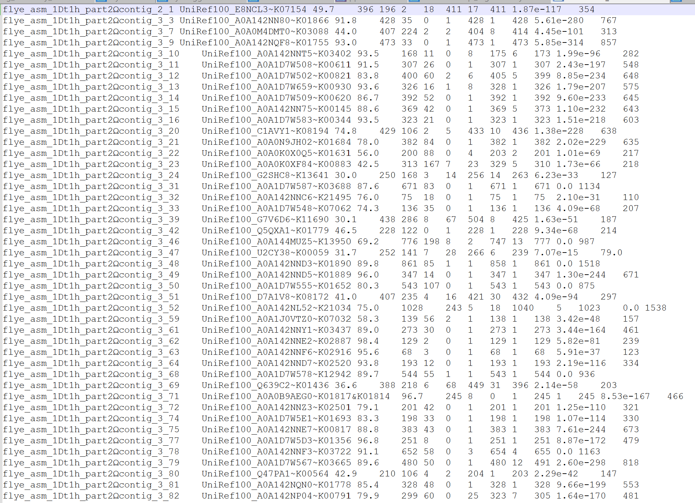

# CheckM2

## Introduction

CheckM2 is a basic secondary analysis to test the quality of the samples provided with a score for completeness and contamination [@chklovski2023].

## Methods

### CheckM2: slurm job

I used the script [run_checkm2TN.sh](https://github.com/tobiasnunn/tnunn_research/blob/main/Research_Experience_Module/00_scripts/Slurmscripts/run_checkm2TN.sh) to run CheckM2 on all 10 fasta files at once.

### CheckM2: R table generation

The CheckM2 job produced a [set of files](https://github.com/tobiasnunn/tnunn_research/tree/main/Research_Experience_Module/02_middle-analysis_outputs/CheckM2_20241228):

```{r}
#| echo: false
#| label: tbl-files
#| tbl-cap: "CheckM2 output files"

filepath <- "../02_middle-analysis_outputs/CheckM2_20241228"

# List files in a directory
files <- list.files(path = filepath, full.names = FALSE, recursive = TRUE)


file_info <- data.frame(
  Filename = files
)

# Display as a formatted table
knitr::kable(file_info)

```

The file I needed was `quality_report.tsv`, which gives info on each sample:

-   Completeness

-   Contamination

-   Completeness Model Used

-   Translation Table Used

I created an R script [CheckM2tablegenerator.R.](https://github.com/tobiasnunn/tnunn_research/blob/main/Research_Experience_Module/00_scripts/Rscripts/CheckM2tablegenerator.R) This produced @tbl-m2

```{r}
#| echo: false
#| label: tbl-diamond
#| tbl-cap: "First five rows of DIAMOND_RESULTS.tsv file"


tsv_data <- read.delim("../02_middle-analysis_outputs/CheckM2_20241228/diamond_output/DIAMOND_RESULTS.tsv", sep = "\t", header = FALSE, nrows = 5)  # Preview first 5 rows

knitr::kable(tsv_data)

```

### Results

```{r}
#| echo: FALSE
#| warning: FALSE
#| label: tbl-m2
#| tbl-align: center
#| tbl-cap: "Quality analysis from CheckM2 based on samples taken from the skin microbiome of *Dendrobates tinctorius*"

library(tidyverse)
library(gt)

checkm2 <- read.csv("../03_final_outputs/metadata_and_quality_tables/checkm2.csv")
checkm2 %>%
  arrange(desc(Completeness)) %>%
  gt()  %>%
  tab_source_note(source_note = "Source: CheckM2 predict performed on 2024-12-28") %>%
  opt_row_striping() %>%
  opt_stylize(style = 5, color = "blue") %>%
  data_color(
    columns = Completeness,
    method = "numeric",
    palette = "Blues",
    domain = c(90, 100),
    reverse = FALSE
  ) %>%
   data_color(
    columns = Contamination,
    method = "numeric",
    palette = "Oranges",
    domain = c(0, 3),
    reverse = FALSE
  ) %>%
  cols_label(Name = "Accession",
             Completeness_Model_Used = "Completeness model used",
             Translation_Table_Used = "Translation table used",
             Additional_Notes = "Additional notes") %>%
  cols_width(
    Completeness_Model_Used ~ px(250)
  )
```

This is the table of CheckM2 analysis, there are many differences in which fields are produced, also, there appears to be differences in the values themselves for Completeness and Contamination, perhaps part of the comparitive analysis, done in the conclusion should be the date at which both were at, as older versions will probably have less accurate values, and this may cause the difference as genomics is a fast evolving field. A noteable difference is that CheckM used an internal diamond database, whereas CheckM2 required me to download my own.

### Scripts

-   [run_checkm2TN.sh](https://github.com/tobiasnunn/tnunn_research/blob/main/Research_Experience_Module/00_scripts/Slurmscripts/run_checkm2TN.sh)

-   [CheckM2tablegenerator.R.](https://github.com/tobiasnunn/tnunn_research/blob/main/Research_Experience_Module/00_scripts/Rscripts/CheckM2tablegenerator.R)

### Comparison of CheckM and CheckM2

```{r}
#| echo: FALSE
#| warning: FALSE
#| label: tbl-mm2
#| tbl-align: center
#| tbl-cap: "Comparison of quality metrics for the same fasta files between CheckM/1.1.3 and CheckM2/0.1.3"

#----------------------combi table gen-------------------------------------
checkm <- read.csv("../03_final_outputs/metadata_and_quality_tables/checkm.csv")
checkm2 <- read.csv("../03_final_outputs/metadata_and_quality_tables/checkm2.csv")
names(checkm2)[names(checkm2) == "Name"] <- "accession"
combicheck <- merge(checkm, checkm2, by = "accession", all = TRUE)
#----------------------combi table product---------------------------------
columnnames <- c("accession", "Completeness.x", "Contamination.x", "Completeness.y", "Contamination.y")
combicheck[columnnames] %>%
  arrange(accession) %>%
  gt() %>%
  fmt_number(
    columns = c(Completeness.x, Contamination.x, Completeness.y, Contamination.y),
    decimals = 2,
    use_seps = TRUE)  %>%
  tab_source_note(source_note = md("Source:  
                  CheckM lineage_wf performed on 2024-12-25  
                  CheckM2 predict performed on 2024-12-28")) %>%
  opt_row_striping() %>%
  opt_stylize(style = 5, color = "blue") %>%
  data_color(
    columns = c(Completeness.x, Completeness.y),
    method = "numeric",
    palette = "Blues",
    domain = c(90, 100),
    reverse = FALSE
  ) %>%
   data_color(
    columns = c(Contamination.x, Contamination.y),
    method = "numeric",
    palette = "Oranges",
    domain = c(0, 3),
    reverse = FALSE
  ) %>%
  tab_spanner(
    label = "CheckM/1.1.3",
    columns = c("Completeness.x", "Contamination.x")) %>%
  tab_spanner(
    label = "CheckM2/0.1.3",
    columns = c("Completeness.y", "Contamination.y")) %>%
  cols_label(Completeness.x = "Completeness",
         Completeness.y = "Completeness",
         Contamination.x = "Contamination",
         Contamination.y = "Contamination",
         accession = "Accession")
   
```

## CheckM2 DIAMOND_RESULTS.tsv

### Introduction

I decided to take a look at the full outputs of CheckM2 to see if there was anything interesting to analyse other than the Completeness and Contamination, I found this file called [DIAMOND_RESULTS.tsv](https://github.com/tobiasnunn/tnunn_research/blob/main/Research_Experience_Module/02_middle-analysis_outputs/CheckM2_20241228/diamond_output/DIAMOND_RESULTS.tsv). It has a bunch of weird stuff in it, I did however recognise the existence of KO pathways in the second column, along with links to a website that displays 3D images of proteins, so I decided to take a closer look at this file.

### Methods

The file did not output with column headers, I believe the ones found [here](https://www.metagenomics.wiki/tools/blast/blastn-output-format-6) match up well, but the descriptions of some are vague, so I am not sure what the significance of a few of the columns is. Due to the size of DIAMOND_RESULTS.tsv, I decided not to include it as a table or image in this document. I created this [R script](https://github.com/tobiasnunn/tnunn_research/blob/main/Research_Experience_Module/00_scripts/Rscripts/CheckM2diamondanalysis.R) to import the data to a table and do an analysis of the important looking fields. This was quite a difficult task that made this little project stretch over 2 days. The main output I wanted from this was a comparison between the KO pathways outputted from this and those outputted by Eggnog-mapper. Eggnog-mapper still is not working on Hawk so maybe we could get the KO pathways for the heatmaps through CheckM2 instead. I did this analysis at two levels, a comparison of which unique KOs each system recognised, and the "cumulative" or total differences.

I figured if I am going to make decisions based on if two methods are different, I should compare them statistically instead of eyeballing it. It is simple enough, tests, graphs, that sort of stuff. This lead me to do many things in R, but only some of the analyses I did were valid. I started off testing which KO values against which accessions in each file, excluding repetitions. However, I then realised that this methodology did not give a full picture of the results, so I decided to work on trying to identify when duplicates occured and add them to the dataset. After much trial and error to get right, I created [this file](https://github.com/tobiasnunn/tnunn_research/blob/main/Research_Experience_Module/00_scripts/Rscripts/CheckM2diamondanalysis.R). I included all the dead-ends as comments at the end for posterity. I finally decided to use the shared KO values divided by the total for each accession and method to create my values showing the differences between DIAMOND and eggNog-mapper. I then decided to run a statistical analysis to see if the differences observed between groups was significant.

### Results

```{r}
#| echo: FALSE
#| label: fig-diamond
#| fig-align: center
#| fig-cap: "The original file is very large, so I cannot include it in the document, there is a line for each gene in all 10 samples. Here is a screenshot of it in Notepad ++"


```

```{r}
#| echo: FALSE
#| warning: FALSE
#| label: tbl-2other
#| tbl-align: center
#| tbl-cap: "Unique KO pathway analysis from CheckM2 based on samples taken from the skin microbiome of *Dendrobates tinctorius*"

unique <- read.csv("../02_middle-analysis_outputs/CheckM2_20241228/uniquecomp.csv")
unique %>%
  gt()  %>%
  tab_source_note(source_note = "Source: DIAMOND_RESULTS.tsv produced by CheckM2 predict performed on 2024-12-28") %>%
  opt_row_striping() %>%
  opt_stylize(style = 5, color = "blue") %>%
 # tab_header(
  #  title = "Table 7 - Unique KO pathway analysis from CheckM2",
   # subtitle = md("based on samples taken from the skin microbiome of *Dendrobates tinctorius*")
#  ) %>%
  cols_label(accession = "Accession",
             tot_rows = "Total unique KOs",
             diamond = "KO # in DIAMOND file",
             egg = "KO # from eggNog-mapper files",
             diamond_per = "% diff DIAMOND - eggNog",
             egg_per = "% diff eggNog - DIAMOND")
```

```{r}
#| echo: FALSE
#| warning: FALSE
#| label: tbl-2otherother
#| tbl-align: center
#| tbl-cap: "KO pathway Total Frequency analysis from CheckM2 based on samples taken from the skin microbiome of *Dendrobates tinctorius*"

cumul <- read.csv("../02_middle-analysis_outputs/CheckM2_20241228/cumcomb.csv")
cumul %>%
  gt()  %>%
  tab_source_note(source_note = "Source: DIAMOND_RESULTS.tsv produced by CheckM2 predict performed on 2024-12-28") %>%
  opt_row_striping() %>%
  opt_stylize(style = 5, color = "blue") %>%
  cols_label(accession.e = "Accession",
             ko_value.e = "EggNog-mapper most-frequent KO pathways",
             tot_rows.e = "Ocurrance number in genome",
             ko_value.d = "DIAMOND most-frequent KO pathways",
             tot_rows.d = "Ocurrance number in genome")
```

@tbl-2other and @tbl-2otherother represent my analysis of the `DIAMOND_RESULTS.tsv` file. I decided to do this by comparing it to the outputs I got from eggNog-mapper when I ran it earlier in the year. @tbl-2other represents a comparison of unique KO pathways. Often, the same KO pathway is found multiple times in the same genome, this makes evolutionary sense but if CheckM2 is a good alternative to eggNog-mapper, which does not work on hawk yet then it must find similar KO pathways. @tbl-2other would confirm this as similarities between output files consistently stay above 85%. Table 8 represents a comparison of highest frequency, taken as the top 5 most frequent for each genome. Basically, what are each system finding most often. Often, there will be similarities, with values only off by 2 or 3, however, occasionally the most common in DIAMOND will be absent from the list for eggNog-mapper and vice-versa.

### Statistical analysis results

```{r}
#| echo: FALSE
#| warning: FALSE
#| label: tbl-finaldiamond
#| tbl-align: center
#| tbl-cap: "Shared KO values between two systems represented as proportions of their totals based on samples taken from the skin microbiome of *Dendrobates tinctorius*"

groupby <- read.csv("../03_final_outputs/misc/DIAMONDeggcomp.csv")
groupby %>%
  gt()  %>%
  tab_source_note(source_note = "Source: DIAMOND_RESULTS.tsv produced by CheckM2 predict performed on 2024-12-28 and the series of eggNog-mapper outputs I generated using eggNog-mapper v2 for the web 2024-08-28") %>%
  opt_row_striping() %>%
  opt_stylize(style = 5, color = "blue") %>%
  cols_label(DIAMOND_per = "% of shared KO values present in DIAMOND_RESULTS.tsv",
             eggNog_per = "% of shared KO values present in eggNog-mapper outputs") %>%
  fmt_percent(
    columns = c(DIAMOND_per, eggNog_per),
    decimals = 1,
    use_seps = TRUE)
```

```{r stattestDIAegg, echo=TRUE, warning=FALSE}
shapiro.test(groupby$DIAMOND_per)
shapiro.test(groupby$eggNog_per)

compttest <- t.test(groupby$DIAMOND_per, groupby$eggNog_per)
compttest
```

@tbl-finaldiamond shows that the common KO values represent a very large proportion of the total KO values for both methods and all accessions, never dipping below 80%. Shapiro testing showed that a parametric test could be used for this. I decided on a Student's t-test(t(15.199) = -1.6563, p = 0.1182). As the p value is larger than 0.05, we accept the null hypothesis that the groups are not significantly different.

#### Scripts
- [CheckM2diamondanalysis.R](https://github.com/tobiasnunn/tnunn_research/blob/main/Research_Experience_Module/00_scripts/Rscripts/CheckM2diamondanalysis.R)