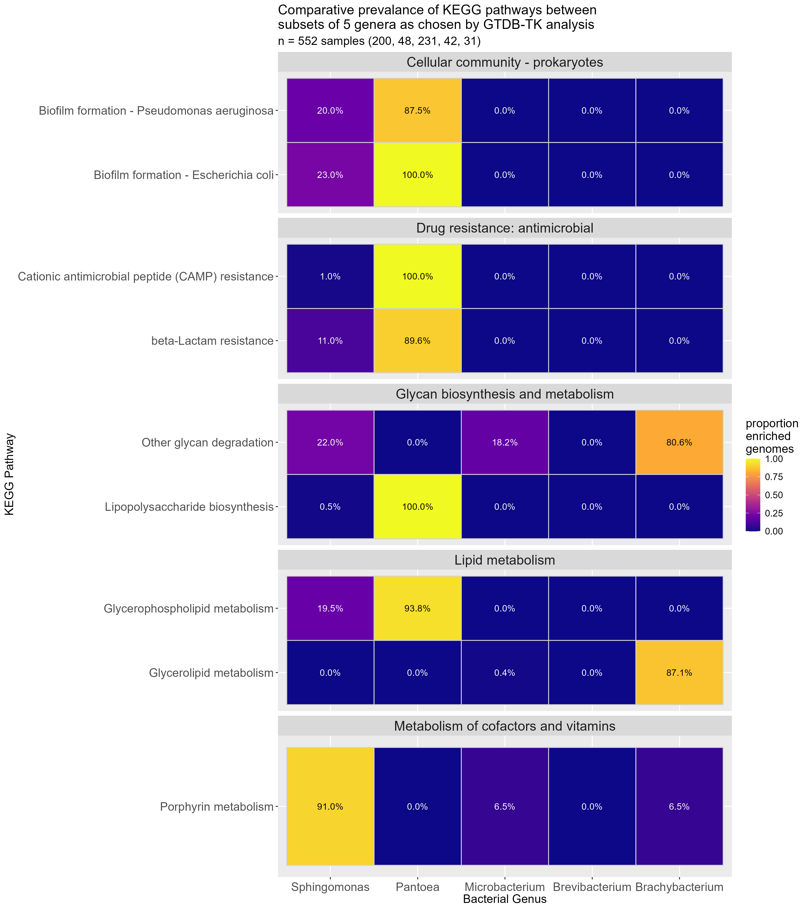

# EggNOG-mapper full process {#sec-eggnogfull}

## Introduction

I had downloaded the .fasta files from the NCBI database. However, before KEGG pathway analysis could be performed these genome sequences needed to be annotated[^eggnogmapper_final-1]. To do this, I used a program called eggNOG-mapper[^eggnogmapper_final-2]. For reference, see [@huerta-cepas2017]. This process gave me an annotated .xlsx formatted file for each sample that I would then enrich in R (that process is talked about on a later page).

[^eggnogmapper_final-1]: annotation

    Here meaning the process by which genes are identified from chunks of genome

[^eggnogmapper_final-2]: version

    Specifically, the version on Hawk was version 2.1.12

## Methods

### Create metadata {#sec-metadata}

In order to support the subsequent steps, I generated a metadata file containing the accession and genus of each sample downloaded from the NCBI. This was done using [KEGG_pipeline_metadata_maker.R](https://github.com/tobiasnunn/tnunn_research/blob/main/Research_Experience_Module/00_scripts/Rscripts/KEGG_pipeline_metadata_maker.R) to create a file called [`genera_metadata.tsv`](https://github.com/tobiasnunn/tnunn_research/blob/main/Research_Experience_Module/02_middle-analysis_outputs/eggnog_stuff/post_eggnog_pipeline/genera_metadata.tsv)[^eggnogmapper_final-3]

[^eggnogmapper_final-3]: metadata

    This was a longer process of metadata file creation as follows:

    1.  [NCBI_metadata_collector.R](https://github.com/tobiasnunn/tnunn_research/blob/main/Research_Experience_Module/00_scripts/Rscripts/NCBI_Metadata_collector_2nd_ver.R) reads in the `gtdb-tk` output file [gtdbtk.bac120.decorated.tree-taxonomy](https://github.com/tobiasnunn/tnunn_research/blob/main/Research_Experience_Module/02_middle-analysis_outputs/gtdbtk_stuff/20241224_de_novo_wf/gtdbtk.bac120.decorated.tree-taxonomy) and outputs [genera_analysis.tsv](https://github.com/tobiasnunn/tnunn_research/blob/main/Research_Experience_Module/02_middle-analysis_outputs/analysis_tables/genera_analysis.tsv)
    2.  [jsondataexplorationprep.R](https://github.com/tobiasnunn/tnunn_research/blob/main/Research_Experience_Module/00_scripts/Rscripts/jsondataexplorationprep.R) reads in `genera_analysis.tsv` and outputs [genera_analysis_combined.tsv](https://github.com/tobiasnunn/tnunn_research/blob/c2c0aae0c8679fa89983776de2fcf7e7eadb5004/Research_Experience_Module/02_middle-analysis_outputs/analysis_tables/genera_analysis_combined.tsv)
    3.  [KEGG_pipeline_metadata_maker.R](https://github.com/tobiasnunn/tnunn_research/blob/main/Research_Experience_Module/00_scripts/Rscripts/KEGG_pipeline_metadata_maker.R) reads in `genera_analysis_combined.tsv` and [`genera_metadata.tsv`](https://github.com/tobiasnunn/tnunn_research/blob/main/Research_Experience_Module/02_middle-analysis_outputs/eggnog_stuff/post_eggnog_pipeline/genera_metadata.tsv)

### Annotation

For small numbers of .fasta files, there is a [website](http://eggnog-mapper.embl.de/) where you can upload the files manually and the analysis is performed. The [output files](https://github.com/eggnogdb/eggnog-mapper/wiki/eggNOG-mapper-v2.1.5-to-v2.1.12#user-content-Output_files) can be downloaded manually afterwards. However, for the large number of fasta files involved in this analysis, I needed to be able to automate the process on hawk.

As I have described in @sec-eggnogproto, this involved creating a number of bash scripts and a set of 'control' files, containing groups of 20 accession IDs and file names.

1.  [slurmsquared.sh](https://github.com/tobiasnunn/tnunn_research/blob/main/Research_Experience_Module/00_scripts/Slurmscripts/slurmsquared.sh) loops over the control files line by line
2.  For each line, the slurm script [eggnogslurmrunner.sh](https://github.com/tobiasnunn/tnunn_research/blob/main/Research_Experience_Module/00_scripts/Slurmscripts/eggnogslurmrunner.sh) is executed. This calls `emapper.py` as follows in the code block <code style="white-space: pre-wrap; word-wrap: break-word;">emapper.py -m diamond --itype genome --genepred prodigal -i /home/b.tbn23vlc/fasta_files/\${filename} -o \${accession} --output_dir /home/b.tbn23vlc/\${accession}\_annotation/ --cpu 0 --dmnd_ignore_warnings --evalue 0.001 --score 60 --pident 40 --query_cover 20 --subject_cover 20 --tax_scope auto --target_orthologs all --go_evidence non-electronic --pfam_realign none --report_orthologs --decorate_gff yes --excel --dbmem</code>
3.  Finally [eggnog_annotation_getter.sh](https://github.com/tobiasnunn/tnunn_research/blob/main/Research_Experience_Module/00_scripts/Slurmscripts/eggnog_annotation_getter.sh) copies the Excel output file to a separate folder to make them easier to download.
4.  The files are stored in [this folder](https://github.com/tobiasnunn/tnunn_research/tree/main/Research_Experience_Module/02_middle-analysis_outputs/eggnog_stuff/eggnog_outputs) in my Github repo.

The Excel file contains the following information, shown in this example file:

```{r}
#| echo: false
#| warning: false
#| label: tbl-eggnogexample
#| tbl-cap: "EggNOG-mapper annotation file example using accession GCA_001464615.1. First five rows only shown"

library(readxl)
library(DT)
examplefile <- read_xlsx("../02_middle-analysis_outputs/eggnog_stuff/eggnog_outputs/GCA_001464615.1.emapper.annotations.xlsx", skip = 2)  

table <- datatable(head(examplefile, 5))
table
```

Although there is a column called 'KEGG pathway' only the column 'KEGG_ko' is used in the further analysis.

### Enrichment

Originally in this part of the process I was calling `MicrobiomeProfiler::enrichKO` once for each KEGG KO in each Excel file. This created some very strange results and I eventually realised that I needed to pass all KEGG KOs in each Excel file into a single call to `enrichKO`.

I did this using this script [part1_enrich](https://github.com/tobiasnunn/tnunn_research/blob/main/Research_Experience_Module/00_scripts/Rscripts/KEGG_pathway_pipeline_p1_enrich.R). After separating all the KEGG KOs into a single list, it calls `enrichKO` and then filters the returned set of results to those where the `p.adjust` value is less than 0.05. I assume this is a probability but I cannot find any documentation on the `enrichResult` class of object returned by the call to `enrichKO`. For reference, see [@wu2021]

The results are then written to a file called `<accession>_ko_pathway.tsv` stored [here](https://github.com/tobiasnunn/tnunn_research/tree/main/Research_Experience_Module/02_middle-analysis_outputs/eggnog_stuff/eggnog_outputs).

```{r}
#| echo: false
#| warning: false
#| label: tbl-enrichexample
#| tbl-cap: "KO enrichment example using accession GCA_001464615.1"

library(tidyverse)
library(DT)
examplefile <- read_tsv("../02_middle-analysis_outputs/eggnog_stuff/eggnog_outputs/GCA_001464615.1_ko_pathway.tsv") 

#fix for Firefox
examplefile$geneID <- gsub("/", ":", examplefile$geneID)


table <- datatable(examplefile, options = list(pageLength = 5))
table
```

### Aggregate results by genus

I used the script [part2_aggregate](https://github.com/tobiasnunn/tnunn_research/blob/main/Research_Experience_Module/00_scripts/Rscripts/KEGG_pathway_pipeline_p2_aggregate.R) to do the following:

-   I read in each `<accession>_ko_pathway.tsv` file using the metadata file mentioned in @sec-metadata to select the correct ones
-   I created a count of how many times each KO pathway ID appeared in the samples for each genus
-   This info was then written to [`genera_kegg_enriched_mapids.tsv`](https://github.com/tobiasnunn/tnunn_research/blob/main/Research_Experience_Module/02_middle-analysis_outputs/eggnog_stuff/post_eggnog_pipeline/genera_kegg_enriched_mapids.tsv) so that I did not have to perform the aggregation multiple times
-   the data was then pivoted so that there were columns for each genus and written to [`genera_kegg_enriched_pathways_revised.tsv`](https://github.com/tobiasnunn/tnunn_research/blob/main/Research_Experience_Module/02_middle-analysis_outputs/eggnog_stuff/post_eggnog_pipeline/genera_kegg_enriched_pathways_revised.tsv)

The resultant file looks like this

```{r}
#| echo: false
#| warning: false
#| label: tbl-pivotpathways
#| tbl-cap: "KEGG pathways counted by genus"

examplefile <- read_tsv("../02_middle-analysis_outputs/eggnog_stuff/post_eggnog_pipeline/genera_kegg_enriched_pathways_revised.tsv") 

table <- datatable(examplefile)
table
```

#### Proportion of samples containing pathway

In order to analyse what proportion of all the samples for a particular genus expressed each pathway, I used a third script [KEGG_pathway_pipeline_p3_proportion.R](https://github.com/tobiasnunn/tnunn_research/blob/main/Research_Experience_Module/00_scripts/Rscripts/KEGG_pathway_pipeline_p3_proportion.R) to do the following:

-   calculate what proportion (between 0 and 1) of all samples for each genus expressed each pathway
-   select only those pathways where the pathway was expressed in 80% or more in one genus and 50% or lower in all other genera
-   create a heatmap and save it to a png file

## Results

### Heatmap

This produced the following heatmap

```{r}
#| echo: false
#| label: fig-finalheat
#| fig-cap: "Heatmap showing those KEGG pathways expressed in 80% of one genus' samples but less than 50% of all other genera's samples"




```

As can be seen in @fig-finalheat, metabolism makes up three of the five KEGG groupings. Seen to be more enriched in one Genus than the others. With the other two being Drug resistence and biofilm formation. The Genus *Pantoea* makes up 6 of the 9 pathways found, with *Microbacterium* and *Brevibacterium* having none. **£footnote add more to this if can**

### Descriptions

Having identified the important pathways for this analysis, I want to understand what each signifies so they can be described and better understood. In order to generate the groupings on the heatmap, I created a file called [genera_KEGG_metadata.tsv](https://github.com/tobiasnunn/tnunn_research/blob/main/Research_Experience_Module/02_middle-analysis_outputs/analysis_tables/genera_KEGG_metadata.tsv), using the KEGGREST API (as described in @sec-ncbi). This data has descriptions of pathways I did not use. Thus, I can use that data again here to contruct a table describing the pathways.

```{r}
#| echo: false
#| warning: false
#| label: tbl-desc
#| tbl-cap: "Table describing those KEGG pathways expressed in 80% of one genus' samples but less than 50% of all other genera's samples"

library(tidyverse)
library(gt)

kegg_metadata <- read_delim("../02_middle-analysis_outputs/analysis_tables/genera_KEGG_metadata.tsv", delim = "\t")


metadatafile <- "../02_middle-analysis_outputs/eggnog_stuff/post_eggnog_pipeline/genera_metadata.tsv"
countfilename <- "../02_middle-analysis_outputs/eggnog_stuff/post_eggnog_pipeline/genera_kegg_enriched_pathways_revised.tsv"

high_lim <- 0.8
low_lim <- 0.5

metadata <- read_delim(metadatafile, delim = "\t", show_col_types = FALSE)
raw_counts <- read_delim(countfilename, delim = "\t", show_col_types = FALSE)

genera_count <- metadata %>% group_by(genus) %>% count(name = "total")

genera <- c("Brevibacterium", "Microbacterium", "Brachybacterium", "Pantoea", "Sphingomonas")

raw_counts <- select(raw_counts, map_id | all_of(genera))


prop_count <- raw_counts %>% pivot_longer(cols = -map_id, names_to = "genus", values_to = "count") %>% 
  left_join(genera_count, by = "genus") %>% 
  mutate(prop = count / total) %>% 
  select(map_id, genus, prop) %>% 
  pivot_wider(names_from = "genus", values_from = "prop") 

numeric_cols <- names(prop_count)[sapply(prop_count, is.numeric)]

filtered_prop_count <- prop_count %>% 
  rowwise() %>%
  filter(sum(c_across(where(is.numeric)) > high_lim) == 1 & 
           sum(c_across(where(is.numeric)) < low_lim) == length(numeric_cols) - 1) %>%
  ungroup() %>%
  pivot_longer(cols = -map_id, names_to = "genus", values_to = "prop")


mapids <- unique(filtered_prop_count$map_id)
final <- filter(kegg_metadata, map %in% mapids) %>% 
  select(!c(class, dblinks)) %>% 
  gt(groupname_col = "subclass") %>%
  tab_source_note(source_note = "Source: KEGG database downloaded using the KEGGREST API on the 16th of February 2025") %>%
 # opt_row_striping() %>%
  opt_stylize(style = 5, color = "blue") %>%
  cols_label(map = "Pathway ID",
          name = "Pathway name",
          description = "Pathway description") %>% 
  sub_missing(
    missing_text = "---"
  )
  #        Longest.contig = "Longest contig",
  #        Coding.density = "Coding density",
  #        predicted.genes = "Predicted genes",
  #        accession = "Accession")
final

```

@tbl-desc describes many, but not all of the pathways present in the heatmap. This is because the KEGG database can be inconsistent with descriptions. For the three pathways without description, I will elaborate here by manually looking up the pathways online and making my own descriptions. £bookmark do that

## Scripts

-   [KEGG_pathway_pipeline_p1_enrich.R](https://github.com/tobiasnunn/tnunn_research/blob/main/Research_Experience_Module/00_scripts/Rscripts/KEGG_pathway_pipeline_p1_enrich.R)

-   [KEGG_pathway_pipeline_p2_aggregate.R](https://github.com/tobiasnunn/tnunn_research/blob/main/Research_Experience_Module/00_scripts/Rscripts/KEGG_pathway_pipeline_p2_aggregate.R)

-   [KEGG_pathway_pipeline_p3_proportion.R](https://github.com/tobiasnunn/tnunn_research/blob/main/Research_Experience_Module/00_scripts/Rscripts/KEGG_pathway_pipeline_p3_proportion.R)

## Next steps

I have identified and described important pathways. However, I believe further literature review is needed so that I may hypothesise what these differences might mean for a host-associated microbiome and possibly find a way to test this, though that may not be possible without more practical means.

The dataset that generates this heatmap has much more potential for further analysis. For example, I have identified that Pantoea contains the majority of the distinct pathways, so I would like to see a version of this heatmap without Pantoea present and compare the pathways found with the original.

Similarly, I have identified relationships between the local samples and closely related NCBI samples. However, an interesting comparison may be to identify how these local bacteria differ from each other, and how that might cause differences in their genetics. For example, I have already taken a cursory glance online and found that Sphingomonas and Pantoea are Gram-negative, the others are Gram-positive. Perhaps next year I will look into literature around this to see if there is any significance for my samples.

Finally, I read a paper on Chytridiomycosis that stood out to me by @becker2009. In it they discuss how they identified a species of bacteria that produces a chemical called violacein. This chemical has anti-chytrid properties. I would be interested in identifying the pahtways that make this or similar chemicals and seeing if they exist in my dataset. Another potential analysis could be to compare species that make these anti-chytrid chemicals between amphibian and non-amphibian hosts, to see if this chemical similarly exists on non-amphibians, despite the risk of chytrid infection not existing.
