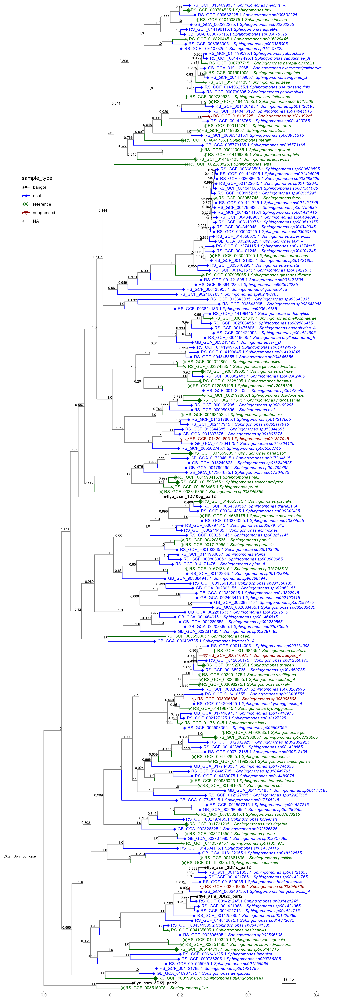
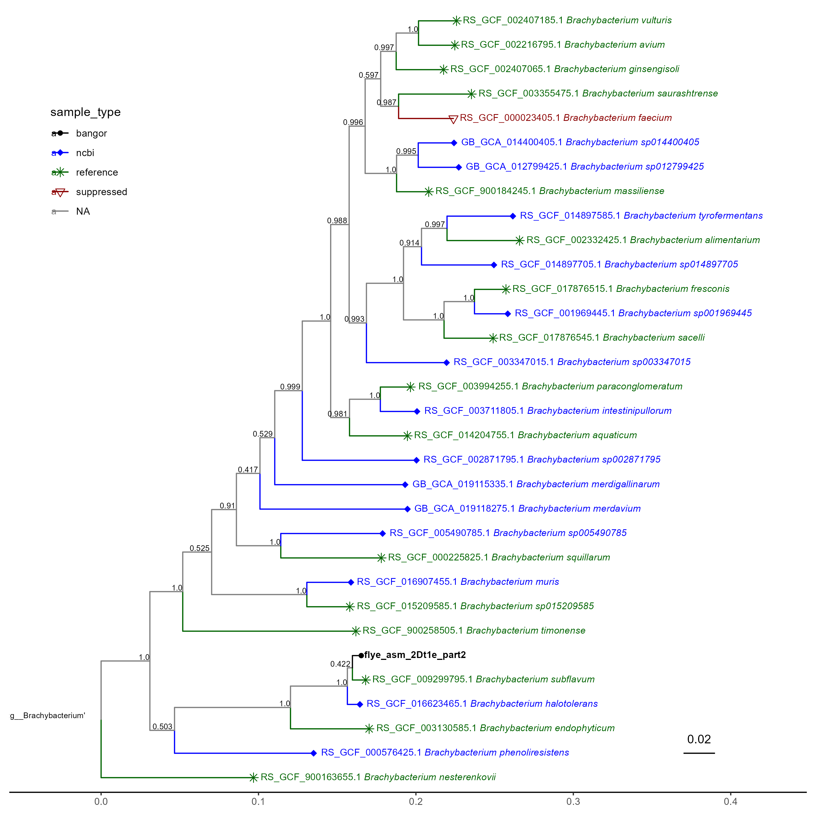
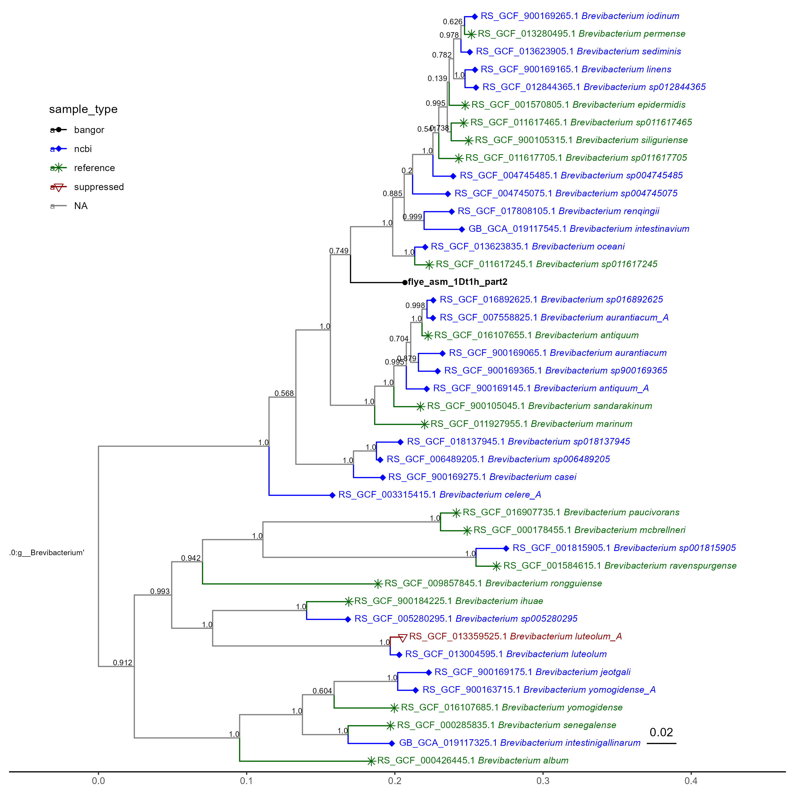
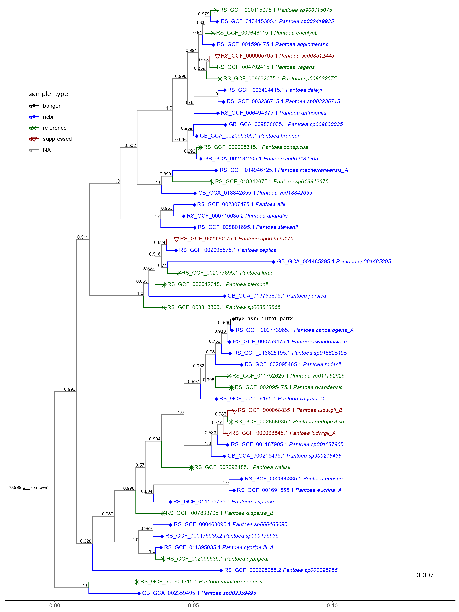
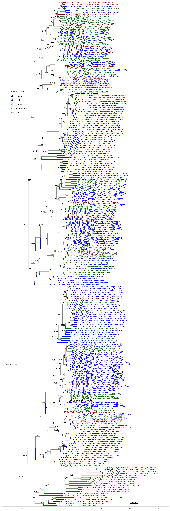

# GTDB-TK de novo {#sec-denovo}

## Introduction
£bookmark citation: https://academic.oup.com/bioinformatics/article/36/6/1925/5626182

Earlier in the year I had used GTDB-TK to identify Genera for the 10 samples and create phylogenetic trees, this is described in @sec-classify. However, upon review of these trees I found oddities, errors that did not quite make sense.

I decided to take a closer look at the [documentation](https://ecogenomics.github.io/GTDBTk/index.html) for GTDB-TK to see what I had done exactly. I had initially used the [classify_wf](https://ecogenomics.github.io/GTDBTk/commands/classify_wf.html?highlight=classify_wf), it was here I discovered the [de_novo_wf](https://ecogenomics.github.io/GTDBTk/commands/de_novo_wf.html). It states:

>  The *de novo* workflow infers new bacterial and archaeal trees containing all user supplied and GTDB-Tk reference genomes. The classify workflow is recommended for obtaining taxonomic classifications, and this workflow only recommended if a *de novo* domain-specific trees are desired. **One should take the taxonomic assignments as a guide, but not as final classifications**. In particular, no effort is made to resolve the taxonomic assignment of lineages composed exclusively of user submitted genomes.

I took this to mean that the `de_novo` workflow would be a more accurate way of estimating the taxonomic assignment of the samples. Though now I re-read it I am not so sure. I found a paper that discusses this, [@chaumeil2022]. I then read this page, [on a discussion board](https://forum.gtdb.ecogenomic.org/t/when-should-i-use-classify-wf-instead-of-da-novo-wf/518). From what I understand from all of this, `classify_wf` gives good taxonomic assignments, but its trees are not perfect, and de_novo_wf is the opposite, it is weaker at assigning (explaining why that one sample without a major group was such an error for it) but spends more run-time making accurate trees. I shall have to dig up my work on classify, as from what I gather, it was not an error to run it.

## Methods

The de_novo workflow takes the .fasta files for the 10 local samples and runs a few opperations, detailed in the documentation above, to place them in existing trees, these are output as newick .Nexml format. This project uses a few slurm scripts, as it is run on hawk. I produced [this script](https://github.com/tobiasnunn/tnunn_research/blob/main/Research_Experience_Module/00_scripts/Slurmscripts/de_novo_gtdbtk.sh) to run it on hawk.

## Results

## Phylogenetic trees

### Introduction

After `de_novo_wf` analysis is done, the trees can be crafted in R. However, it should be noted this process does not assign taxonomy to the samples one uploads, merely places them in a tree.

### Methods

The outputs from the GTDB-tk `de_novo_wf`, namely the .nexml tree file, can be read into R and modified to make more visually appealing, they can then be combined with metadata to find the names, though now I see these names may not be wholly accurate. I also toyed with the idea of one large, interactive tree, though the capability to do that well is beyond my current skill level. There was one sample for which a taxonomy could not be assigned, meaning I could not isolate it to include in the trees, thus I excluded it from further study, this perhaps was another error on my part I now see. This is done across several scripts £bookmark

### Results

```{r sphingo-tree}
#| echo: FALSE
#| label: fig-sphingo-tree
#| fig-align: center
#| fig-cap: "GTDB-tk de_novo_wf phylogenetic tree for 4 Bangor-made genomic sequences in the genus *Sphingomonas* (seen in the colour black)"

```

```{r tree-2}
#| echo: FALSE
#| label: fig-brachy-tree
#| fig-align: center
#| fig-cap: "GTDB-tk de_novo_wf phylogenetic tree for 1 Bangor-made genomic sequence in the genus *Brachybacterium* (seen in the colour black)"

```

```{r tree-3}
#| echo: FALSE
#| label: fig-brevi-tree
#| fig-align: center
#| fig-cap: "GTDB-tk de_novo_wf phylogenetic tree for 1 Bangor-made genomic sequence in the genus *Brevibacterium* (seen in the colour black)"

```

```{r tree4}
#| echo: FALSE
#| label: fig-panto-tree
#| fig-align: center
#| fig-cap: "GTDB-tk de_novo_wf phylogenetic tree for 1 Bangor-made genomic sequence of disputed genus (seen in the colour black)"

```

```{r tree5}
#| echo: FALSE
#| label: fig-micro-tree
#| fig-align: center
#| fig-cap: "GTDB-tk de_novo_wf phylogenetic tree for 1 Bangor-made genomic sequence of the genus *Microbacterium* (seen in the colour black)"

```


## Scripts

-   [de_novo_gtdbtk.sh](https://github.com/tobiasnunn/tnunn_research/blob/main/Research_Experience_Module/00_scripts/Slurmscripts/de_novo_gtdbtk.sh)