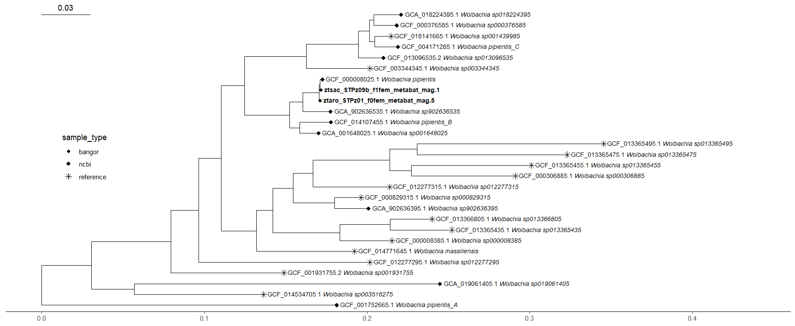

# Wolbachia side-project

## Introduction

In mid-August 2024 I helped with my supervisor Aaron Comeault's paper ("Phylogenetic and functional diversity among Drosophila-associated metagenome-assembled genomes") as a learning exercise for EggNOG-mapper and heatmapping. After receiving notes from the reviewers, Aaron asked me to process two samples of note from the study, that were Wolbachia species through Eggnog mapper and GTDB-TK so as to identify specific "Cif" and "WOPhage" genes. Specifically, I was tasked with answering the questions:

-   Do they harbor the characterized Cif genes? or WOPhage?

-   What other Wolbachia are they closely affiliated with?

## Methods

Both of these processes were run using modified bash scripts I had already made for my own project on Hawk. Specifically; metagenomerunner.sh, metagenomequared.sh and wolbachia_gtdbtk.sh.

### EggNOG-mapper

The first two scripts work in tandem, as their names suggest. The specifications for the eggnog analysis are set in metagenomerunner.sh, including the amount of memory to use, the input file location and where the output files should be located. metagenomequared.sh is passed a file containing a list of the file names and paths, I called this genera_control_file_batch_aa.tsv. metagenomesquared.sh uses this file to set parameters for the accession and filename based on the items in the list, then calls slurm to run metagenomerunner.sh, passing in the parameters. A while loop is used so that the rows can be itterated over, meaning I only need to run metagenomesquared.sh once to get both jobs loaded to hawk. Once the samples are annotated, a copy statement using command-line code at the end of metagenomerunner.sh copies the outputs to my home directory, where they are more easily transferred to my machine. Then, in R, i use a script called gene_analysis.R to load the outputs and attempt to find any reference to these "Cif" or "Wophage" genes. Unlike for the usual analysis, I do not run `Microbiomeprofiler::enrichKO()`, I am unsure whether enrichment would have been relevent for this analysis. Ultimately, none of these genes were found from this analysis.

### blastn

In order to confirm or disprove the result above. Aaron told me to use a program called blastn. I ran this locally on the command line, my commands are stored in the script blaster.txt. These outputted the files; ztaro_tblastn_results.txt and ztsac_tblastn_results.txt

### GTDB-TK

This process also began on hawk, using wolbachia_gtdbtk.sh. This process is simpler, as it takes a directory of .fasta files, for the un-annotated genomes. Then outputs a directory of files which I downloaded to my local machine. Then, using R, I read in the gtdbtk.bac120.decorated.tree output to the treemaker.R script, where I use the package ggtree to make the tree. However, Styling needed to be done for a more interpretable output, to aid this, I used the NCBI REST API to download metadata about the samples mentioned in the tree file, then used that to modify the tip labels and add identifiers of which samples were the local ones.

### Results

Do they harbor the characterized Cif genes? or WOPhage?

After sending the outputs of the blastn analysis (ztaro_tblastn_results.txt and ztsac_tblastn_results.txt) to Aaron. He determined that they do confirm the existence of these genes. As it was not directly for my project, I did not question how he confirmed this. That may have been a mistake on my part.

What other Wolbachia are they closely affiliated with?

```{r tree}
#| echo: FALSE
#| label: fig-tree
#| fig-align: center
#| fig-cap: "Phylogenetic tree showing which strains of Wolbachia are closest related to those isolated from Drosophila flies by Comeault et al."


```

The tree presents that the closest strain to both of the bangor samples are *Wolbachia pipentis*.

### Scripts

this bit is by no means done, and i need to decide on how i want to do this bit, do i give a long list of individual files, directories? the other bits need refinement too, but that can wait until later. £bookmark