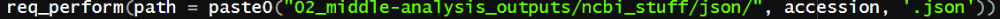
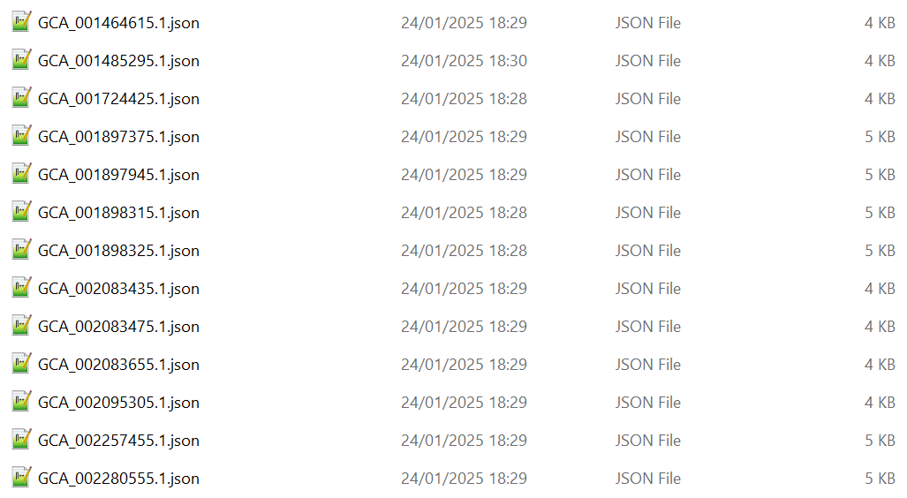

# Introduction {#sec-introduction}

**look for £bookmark for places to revisit**

Bacterial genomics is a field with a lot of potential for practical applications. For example, an understanding of gut microbiomes can have implications for Crohn's disease [@vandeputte2017]. Whilst not the focus of work, this project relates closely to work done on poison dart frogs, with a specific focus on how bacterial skin microbiomes can interact with DB, the chytridiomycosis causing fungus. This builds on several previous studies, such as [@jiménez2017], which found differences in Microbiome can change susceptibility to infection. This will involve the use of many online tools, such as EggNOG-mapper, [@huerta-cepas2017]. An emphasis is put on how host can shape these microbiomes, building on research by [@lunjani2021].

(500 words, 5-10 refs)

# Research evidence

## Mistakes / rework (?) {#sec-rework}

as important as the outputs of this project are to its legitimacy, me learning how to conduct my work in a proper scientific manner is as equally important of an outcome. This work started in the summer, when i had done nothing of the type before, so i had basically no idea what i was doing or what i was messing with. So i made mistakes, many mistakes. Then, i kept going, building on those mistakes until around christmas i realised i was completely out of my depth and i needed to reivaluate. My notetaking especially was crude by modern comparison. So i decided to do a reset, i believed this was important as it allowed me to start again from a more informed point, and "do things right this time". However, i did conduct analysis in the first half of the year that could be relevent, error prone as it may be. And i do not want my mistakes to be buried, they must be remembered so i do not repeat them, or so anyone else reading this does not repeat them. So i would like to dedicate section 2.0. to the mistakes i made and how i learned from them to gain skills and become a better data scientist, as i believe this step was the catalyst for all hereafter steps to be as good as they were, without these errors, i doubt i would have worked as hard to make the work i did after as good, and thats alright.

here::here for good pathing

proper integration of images into the notebooks

(i understand if you need to dock points for this, but i think it is too important to not write down)

## summer stuff (?)

prototypes

### Introduction

This project technically started in the summer of 2024, between July and August. I was tasked with basically making basic explorations of 10 bacterial genome samples made by Bangor Researchers in labs at ECW, as I was still in my first year and did not have much experience, I made mistakes. I also did not recognise the importance of notekeeping at that point, so a record of that work does not exist.

### Methods

The summer work was more of a learning exercise than anything, just for me to familiarise myself with R scripting and bash and hawk so I would have a basis when properly beginning the project

### Results

### Scripts

## Check M lineage_wf

### Introduction

A smaller analysis done towards the beginning of the project. CheckM and CheckM2 analyses were done on the genomic samples downloaded from the NCBI largely for the purposes of data exploration and practice, with a side aim of comparing and contrasting the two programmes, as from what I had read CheckM2 was not a direct predecessor to Check M.

### Methods

Using [this script](https://github.com/tobiasnunn/tnunn_research/blob/6be0be8a1de6b7fd64de79c280d9641f68a0e37c/00_scripts/checkmtest.sh) I ran a slurm job on hawk under the `lineage_wf` of CheckM for all 10 Bangor-made samples, this took just 4 minutes. I also worked on exporting the data I want to tabulate off of hawk. The **past** way I did this was by manually entering each file and noting down the important characteristics. However, because there are going to be more samples(and I wanted to be clever) i decided to use a more automated process. This was done by identifying different documents in the flye directories on hawk, specifically files called "assembly_info.txt" which contain the same information, but are vastly more exportable. These are stored here: cd /scratch/scw2160/02_outputs/flye_asm/flye_asm\_\[accession\]/ using [this script](https://github.com/tobiasnunn/tnunn_research/blob/6be0be8a1de6b7fd64de79c280d9641f68a0e37c/00_scripts/assemblytabledatagetter.sh) I exported them off of hawk.

Using the [CheckM documentation](https://github.com/Ecogenomics/CheckM/wiki/Genome-Quality-Commands#qa). I found the output that i needed was [bin_stats_ext.tsv](https://github.com/tobiasnunn/tnunn_research/blob/0ce45bbddc271c477204cfc7c6d488a9d1d95a87/02_middle-analysis_outputs/CheckM/storage/bin_stats_ext.tsv). this is where the contamination(and a lot of other fun looking stats) are held. I can thusly import this file to R to try and extract usefull stuff / tabulate. Over the course of the day i developed and improved [CheckMtablegenerator.R](https://github.com/tobiasnunn/tnunn_research/blob/60126045c5802ef0627e86df57e7b533ff568e9d/00_scripts/CheckMtablegenerator.R). which creates the table layed out in results below. This uses a few packages, one of which was new to me, `gt`. This is a very useful package for table generation, [here is some info](https://gt.rstudio.com/).

### Results

The CheckM analysis produced [this output directory](https://github.com/tobiasnunn/tnunn_research/tree/0ce45bbddc271c477204cfc7c6d488a9d1d95a87/02_middle-analysis_outputs/CheckM). My export script exported all 10 "assembly_info.txt" files to a directory in my home directory, as well as adding their accession ID to the name, this is important as otherwise i wouldnt know which belonged to what accession. I then brought them down and stored them [here.](https://github.com/tobiasnunn/tnunn_research/tree/6be0be8a1de6b7fd64de79c280d9641f68a0e37c/05_projectdatabase/flyestuff)

```{r checkm-table, echo=FALSE, warning=FALSE}
#| echo: FALSE
#| label: fig-m
#| fig-align: center
#| fig-cap: "Subset of data obtained from CheckM analysis of samples taken from the skin microbiome of *Dendrobates tinctorius*, including metrics of quality."

library(gt)

checkm <- read.csv("03_final_outputs/metadata_and_quality_tables/checkm.csv")
columnnames <- c("accession", "marker.lineage","Completeness", "Contamination","GC","GC.std", "Genome.size", "contigs", "Longest.contig", "Coding.density", "predicted.genes")
checkm[columnnames] %>%
  arrange(desc(Completeness)) %>%
  gt() %>%
  fmt_number(
    columns = c(Completeness, Contamination),
    decimals = 2,
    use_seps = TRUE) %>%
  fmt_percent(
    columns = c(GC, `GC.std`, `Coding.density`),
    decimals = 3,
    use_seps = TRUE) %>%
  fmt_number(
    columns = c(`Genome.size`, `predicted.genes`, `Longest.contig`),
    decimals = 0,
    use_seps = TRUE) %>%
  tab_source_note(source_note = "Source: CheckM lineage_wf performed on 2024-12-25") %>%
  opt_row_striping() %>%
  opt_stylize(style = 5, color = "blue") %>%
  data_color(
    columns = Completeness,
    method = "numeric",
    palette = "Blues",
    domain = c(90, 100),
    reverse = FALSE
  ) %>%
   data_color(
    columns = Contamination,
    method = "numeric",
    palette = "Oranges",
    domain = c(0, 3),
    reverse = FALSE
  ) %>%
 # tab_header(
  #  title = "Table 1 - subset of data obtained from CheckM analysis",
   # subtitle = md("of samples taken from the skin microbiome of *Dendrobates tinctorius*, including metrics of quality.")
    #) %>% 
  cols_label(marker.lineage = "Marker lineage",
         GC.std = "GC std",
         Genome.size = "Genome size",
         Longest.contig = "Longest contig",
         Coding.density = "Coding density",
         predicted.genes = "Predicted genes",
         accession = "Accession")
   
```

### Scripts

## CheckM tree_qa

### Introduction

### Methods

### Results

### Scripts

## CheckM2

### Introduction

A basic secondary analysis to test the quality of the samples provided with a score for completeness and contamination.

### Methods

#### CheckM2: slurm job

Just before lunch(11:45-ish) i set off the slurm job to run CheckM2 on hawk. Let's see how that goes after lunch, one thing of note though, i did make a minor modification, in the original file, i was running it on the fastas one at a time(?) weird, anyway, i changed it to work on the directory containing all 10, so it should do them all at once. [run_checkm2TN.sh](https://github.com/tobiasnunn/tnunn_research/blob/aad7006d65994e391c8621132fd7fab3fbf53609/00_scripts/run_checkm2TN.sh).

#### CheckM2: R table generation

This started with doing `cd /scratch/scw2160/02_outputs/flye_asm/CheckM2_20241228` to see the outputs, the job took roughly half an hour, ending at 12:15 pm. Firstly, i copied the output directory to my home area, then once again used MobaXterm to bring it down to the git repo, [here.](https://github.com/tobiasnunn/tnunn_research/tree/b5c2f08cd3b2b0110d531ca9b3305cdde62d0797/02_middle-analysis_outputs/CheckM2_20241228) Then, i began work on the R file to turn the `quality_report.tsv` file. This file was formatted very well, so turning it into a table was very simple, done in [CheckM2tablegenerator.R.](https://github.com/tobiasnunn/tnunn_research/blob/b5c2f08cd3b2b0110d531ca9b3305cdde62d0797/00_scripts/CheckM2tablegenerator.R) This produced [Table 4: CheckM2]

Note: there were other outputs to CheckM2, they were very interesting, im going to make the next section about exploring that possiblity, but they dont relate to this analysis.

### Results

```{r checkm2, echo=FALSE, warning=FALSE}
#| echo: FALSE
#| label: fig-m2
#| fig-align: center
#| fig-cap: "Quality analysis from CheckM2 based on samples taken from the skin microbiome of *Dendrobates tinctorius*"

checkm2 <- read.csv("03_final_outputs/metadata_and_quality_tables/checkm2.csv")
checkm2 %>%
  arrange(desc(Completeness)) %>%
  gt()  %>%
  tab_source_note(source_note = "Source: CheckM2 predict performed on 2024-12-28") %>%
  opt_row_striping() %>%
  opt_stylize(style = 5, color = "blue") %>%
  data_color(
    columns = Completeness,
    method = "numeric",
    palette = "Blues",
    domain = c(90, 100),
    reverse = FALSE
  ) %>%
   data_color(
    columns = Contamination,
    method = "numeric",
    palette = "Oranges",
    domain = c(0, 3),
    reverse = FALSE
  ) %>%
 #tab_header(
  #  title = "Table 4 - quality analysis from CheckM2",
   # subtitle = md("based on samples taken from the skin microbiome of *Dendrobates tinctorius*")
#  ) %>%
  cols_label(Name = "Accession",
             Completeness_Model_Used = "Completeness model used",
             Translation_Table_Used = "Translation table used",
             Additional_Notes = "Additional notes") %>%
  cols_width(
    Completeness_Model_Used ~ px(250)
  )
```

This is the table of CheckM2 analysis, there are many differences in which fields are produced, also, there appears to be differences in the values themselves for Completeness and Contamination, perhaps part of the comparitive analysis, done in the conclusion should be the date at which both were at, as older versions will probably have less accurate values, and this may cause the difference as genomics is a fast evolving field. A Noteable difference is that CheckM used an internal diamond database, whereas CheckM2 required me to download my own. Exact comparison will be conducted in the conclusion.

### Scripts

### Comparison of CheckM and CheckM2

```{r m_vs_m2, echo=FALSE, warning=FALSE}
#| echo: FALSE
#| label: fig-sphingo-tree
#| fig-align: center
#| fig-cap: "Comparison of quality metrics for the same fasta files between CheckM/1.1.3 and CheckM2/0.1.3"

#----------------------combi table gen-------------------------------------
checkm <- read.csv("03_final_outputs/metadata_and_quality_tables/checkm.csv")
checkm2 <- read.csv("03_final_outputs/metadata_and_quality_tables/checkm2.csv")
names(checkm2)[names(checkm2) == "Name"] <- "accession"
combicheck <- merge(checkm, checkm2, by = "accession", all = TRUE)
#----------------------combi table product---------------------------------
columnnames <- c("accession", "Completeness.x", "Contamination.x", "Completeness.y", "Contamination.y")
combicheck[columnnames] %>%
  arrange(accession) %>%
  gt() %>%
  fmt_number(
    columns = c(Completeness.x, Contamination.x, Completeness.y, Contamination.y),
    decimals = 2,
    use_seps = TRUE)  %>%
  tab_source_note(source_note = md("Source:  
                  CheckM lineage_wf performed on 2024-12-25  
                  CheckM2 predict performed on 2024-12-28")) %>%
  opt_row_striping() %>%
  opt_stylize(style = 5, color = "blue") %>%
  data_color(
    columns = c(Completeness.x, Completeness.y),
    method = "numeric",
    palette = "Blues",
    domain = c(90, 100),
    reverse = FALSE
  ) %>%
   data_color(
    columns = c(Contamination.x, Contamination.y),
    method = "numeric",
    palette = "Oranges",
    domain = c(0, 3),
    reverse = FALSE
  ) %>%
 # tab_header(
  #  title = "Table 5 - Comparison of quality metrics",
   # subtitle = md("for the same fasta files between CheckM/1.1.3 and CheckM2/0.1.3")
    # ) %>%
  tab_spanner(
    label = "CheckM/1.1.3",
    columns = c("Completeness.x", "Contamination.x")) %>%
  tab_spanner(
    label = "CheckM2/0.1.3",
    columns = c("Completeness.y", "Contamination.y")) %>%
  cols_label(Completeness.x = "Completeness",
         Completeness.y = "Completeness",
         Contamination.x = "Contamination",
         Contamination.y = "Contamination",
         accession = "Accession")
   
```

## Flye output analysis

### Introduction

There were some files outputted from the innitial Flye_asm work done by Aaron that I thought warrented a look at to sharpen my teeth on.

### Methods

#### Flye analysis 1: assembly_info.txt

I created an R script, "[rawflyeanalysis.R](https://github.com/tobiasnunn/tnunn_research/blob/aad7006d65994e391c8621132fd7fab3fbf53609/00_scripts/rawflyeanalysis.R)". Basic stuff, imports the text files i chose to download(i wonder if i could download the flye.log files and use a sub() to cut out the non-useful stuff). This then sorts and processes the data into the table seen below using a few packages, \[Table 2: Assembly_info.txt\].

#### Flye analysis 2: flye.log

After lunch, firstly i went back to the flye.log analysis i wanted to do largely for posterity. This was horrifyingly complex due to the "complex" nature of the flye.log files. I did this by creating a modified copy of my assembly_info.txt file grabber shell script, called [flye.loggetter.sh](https://github.com/tobiasnunn/tnunn_research/blob/b5c2f08cd3b2b0110d531ca9b3305cdde62d0797/00_scripts/flye.loggetter.sh), using ctrl + h to find and replace instead of manually changing things. I added this to an existing output directory in my home section of hawk, which i exported using MobaXterm**(do i need to include a section on how i use MobaXterm?)** to my computer**.** This is the folder called [flyestuff](https://github.com/tobiasnunn/tnunn_research/tree/b5c2f08cd3b2b0110d531ca9b3305cdde62d0797/02_middle-analysis_outputs/flyestuff), which contains both the flye.log and the assembly_info.txt files for each accession, i grouped them as it seemed relevent for organisation and didnt hinder the coding process at all. The R file i used to tabulate this is [flyeloganalysis.R](https://github.com/tobiasnunn/tnunn_research/blob/b5c2f08cd3b2b0110d531ca9b3305cdde62d0797/00_scripts/flyeloganalysis.R). This produced [Table 3: Flye.log]

### Results

```{r assemblyinfo, echo=FALSE, warning=FALSE}
#| echo: FALSE
#| label: fig-assem
#| fig-align: center
#| fig-cap: "Data obtained from flye outputs of samples taken from the skin microbiome of *Dendrobates tinctorius*"

processedtable <- read.csv("03_final_outputs/metadata_and_quality_tables/assemblyinfo.csv")
processedtable %>%
  arrange(desc(number_of_contigs)) %>%
  gt() %>%
  fmt_number(
    columns = c(number_of_contigs, total_length, largest_fragment),
    use_seps = TRUE,
    drop_trailing_zeros = TRUE) %>%
  fmt_number(
    columns = c(mean_fragments),
    decimals = 2,
    use_seps = TRUE) %>%
  tab_source_note(source_note = "Source: assembly_info.txt files produced in flye_asm analysis, August 27th 2024") %>%
  opt_row_striping() %>%
  opt_stylize(style = 5, color = "blue") %>%
  data_color(
    columns = number_of_contigs,
    method = "numeric",
    palette = "Blues",
    domain = c(0, 200),
    reverse = FALSE
  ) %>%
  #tab_header(
   # title = "Table 2 - Data obtained from flye outputs",
    #subtitle = md("of samples taken from the skin microbiome of *Dendrobates tinctorius*")
  #) %>%
  tab_footnote(
    footnote = md("coverage could not be calculated from this method as no result matched what was found in the *flye.log* files")
  ) %>%
  cols_label(accession = "Accession",
             number_of_contigs = "Number of contigs",
             total_length = "Total length",
             largest_fragment = "Largest fragment",
             mean_fragments = "Mean fragment length")

```

The basic flye output analysis produced this table, as mentioned, i couldn't get coverage to match what was on the flye.log file that i got the original of this table from, it is possible that file is the one that is wrong, but genome coverage is kind of all over the place, so i just omitted it as i don't think its one of the mandatory fields. I chose to sort the table by "Number of contigs" rather arbitrarily, but it does show something interesting in that why is there such a large range in fragment number?

```{r flyelog, echo=FALSE, warning=FALSE}
#| echo: FALSE
#| label: fig-log
#| fig-align: center
#| fig-cap: "Data obtained from flye.log outputs of samples taken from the skin microbiome of *Dendrobates tinctorius*"

tablenames <- c("Total.length", "Fragments", "Fragments.N50", "Largest.frg", "Scaffolds", "Mean.coverage")
final <- read.csv("03_final_outputs/metadata_and_quality_tables/flyelog.csv")
final %>%
  arrange(desc(`Fragments`)) %>%
  gt() %>%
  fmt_number(
    columns = tablenames,
    use_seps = TRUE,
    decimals = 0)  %>%
  tab_source_note(source_note = "Source: flye.log files produced in flye_asm analysis, August 27th 2024") %>%
  opt_row_striping() %>%
  opt_stylize(style = 5, color = "blue") %>%
  data_color(
    columns = `Fragments`,
    method = "numeric",
    palette = "Blues",
    domain = c(0, 200),
    reverse = FALSE
  ) %>%
 # tab_header(
  #  title = "Table 3 - Data obtained from flye.log outputs",
   # subtitle = md("of samples taken from the skin microbiome of *Dendrobates tinctorius*")
  #) %>% 
  cols_label(accession = "Accession",
             Total.length = "Total length",
             Fragments.N50 = "Fragments N50",
             Largest.frg = "Largest fragment",
             Mean.coverage = "Mean coverage") |>
  cols_move(
    columns = Total.length,
    after = Fragments
  )
```

This is a table of the type of stuff i first collated in the Summer, it shares many similarities and cross overs with Table 2, neither have quality statistics, but both are metadata largely concerning the length and fragment, a marked difference is this one comes with a concrete value of coverage. Comparative analysis of them feels like a thing that would happen in the conclusion to this document.

### Scripts

## Innitial small analysis / comparisons

### Introduction

### Methods

### Results

### Scripts

## DIAMOND_RESULTS.tsv

### Introduction

### Methods

### Results

### Scripts

## GTDB-TK de_novo_wf

### Introduction

Earlier in the year i had used GTDB-TK to identify Genera for the 10 samples and create phylogenetic trees. However, upon review of these trees i found oddities, errors that did not quite make sense.

I decided to take a closer look at the [documentation](https://ecogenomics.github.io/GTDBTk/index.html) for GTDB-TK to see what I had done exactly. I had innitially used the [classify_wf](https://ecogenomics.github.io/GTDBTk/commands/classify_wf.html?highlight=classify_wf), it was here I discovered the [de_novo_wf](https://ecogenomics.github.io/GTDBTk/commands/de_novo_wf.html). It states:

"The *de novo* workflow infers new bacterial and archaeal trees containing all user supplied and GTDB-Tk reference genomes. The classify workflow is recommended for obtaining taxonomic classifications, and this workflow only recommended if a *de novo* domain-specific trees are desired. **One should take the taxonomic assignments as a guide, but not as final classifications**. In particular, no effort is made to resolve the taxonomic assignment of lineages composed exclusively of user submitted genomes."

I took this to mean that the de_novo_workflow would be a more accurate way of estimating the taxonomic assignment of the samples. Though now i re-read it I am not so sure. I found a paper that discusses this, [@chaumeil2022]. I then read this page, [on a discussion board](https://forum.gtdb.ecogenomic.org/t/when-should-i-use-classify-wf-instead-of-da-novo-wf/518). From what I understand from all of this, Classify_wf gives good taxonomic assignments, but its trees are not perfect, and de_novo_wf is the opposite, it is weaker at assigning (explaining why that one sample without a major group was such an error for it) but spends more run-time making accurate trees. I shall have to dig up my work on classify, as from what i gather, it was not an error to run it.

### Methods

The de_novo workflow takes the .fasta files for the 10 local samples and runs a few opperations, detailed in the documentation above, to place them in existing trees, these are output as newick .Nexml format. This project uses a few slurm scripts, as it is run on hawk. I produced [this script](https://github.com/tobiasnunn/tnunn_research/blob/21f2fb071d76040dc82286b9399cb11ff11a3b3c/00_scripts/de_novo_gtdbtk.sh) to run it on hawk.

### Results

### Scripts

## GTDB-tk Classify_wf

### Introduction

I did this workflow earlier in the year, I innitially assumed it was inferior to the de_novo workflow upon discovery of it. However, new information makes me think that they are meant to both be run, this workflow is better suited to taxonomic assignment, so the names should be better trusted here.

### Methods

This process runs very similar, with only one bit of code needing changing

### Results

### Scripts

## Phylogenetic trees

### Introduction

After de_novo_wf analysis is done, the trees can be crafted in R. However, it should be noted this process does not assign taxonomy to the samples one uploads, merely places them in a tree

### Methods

the outputs from the GTDB-tk de_novo_wf, namely the .nexml tree file, can be read into R and modified to make more visually appealing, they can then be combined with metadata to find the names, though now I see these names may not be wholly accurate. I also toyed with the idea of one large, interactive tree, though the capability to do that well is beyond my current skill level. There was one sample for which a taxonomy could not be assigned, meaning I could not isolate it to include in the trees, thus I excluded it from further study, this perhaps was another error on my part I now see. This is done across several scripts £bookmark

### Results

```{r sphingo-tree}
#| echo: FALSE
#| label: fig-sphingo-tree
#| fig-align: center
#| fig-cap: "GTDB-tk de_novo_wf phylogenetic tree for 4 Bangor-made genomic sequences in the genus *Sphingomonas* (seen in the colour black)"
knitr::include_graphics(here::here("02_middle-analysis_outputs/gtdbtk_stuff/output_trees", "Sphingo_tree.png"))
```

```{r tree-2}
#| echo: FALSE
#| label: fig-brachy-tree
#| fig-align: center
#| fig-cap: "GTDB-tk de_novo_wf phylogenetic tree for 1 Bangor-made genomic sequence in the genus *Brachybacterium* (seen in the colour black)"
knitr::include_graphics(here::here("02_middle-analysis_outputs/gtdbtk_stuff/output_trees", "Brachy_tree.png"))
```

```{r tree-3}
#| echo: FALSE
#| label: fig-brevi-tree
#| fig-align: center
#| fig-cap: "GTDB-tk de_novo_wf phylogenetic tree for 1 Bangor-made genomic sequence in the genus *Brevibacterium* (seen in the colour black)"
knitr::include_graphics(here::here("02_middle-analysis_outputs/gtdbtk_stuff/output_trees", "Brevi_tree.png"))
```

```{r tree4}
#| echo: FALSE
#| label: fig-panto-tree
#| fig-align: center
#| fig-cap: "GTDB-tk de_novo_wf phylogenetic tree for 1 Bangor-made genomic sequence of disputed genus (seen in the colour black)"
knitr::include_graphics(here::here("02_middle-analysis_outputs/gtdbtk_stuff/output_trees", "Panto_tree.png"))
```

```{r tree5}
#| echo: FALSE
#| label: fig-micro-tree
#| fig-align: center
#| fig-cap: "GTDB-tk de_novo_wf phylogenetic tree for 1 Bangor-made genomic sequence of the genus *Microbacterium* (seen in the colour black)"
knitr::include_graphics(here::here("02_middle-analysis_outputs/gtdbtk_stuff/output_trees", "Micro_tree.png"))
```

### Scripts



## Wolbachia side-project

### Introduction

In mid-August 2024 I helped with my supervisor Aaron Comeault's paper ("Phylogenetic and functional diversity among Drosophila-associated metagenome-assembled genomes") as a learning exercise for EggNOG-mapper and heatmapping. After receiving notes from the reviewers, Aaron asked me to process two samples of note from the study, that were Wolbachia species through Eggnog mapper and GTDB-TK so as to identify specific "Cif" and "WOPhage" genes. Specifically, I was tasked with answering the questions:

-   Do they harbor the characterized Cif genes? or WOPhage?

-   What other Wolbachia are they closely affiliated with?

### Methods

Both of these processes were run using modified bash scripts I had already made for my own project on Hawk. Specifically; metagenomerunner.sh, metagenomequared.sh and wolbachia_gtdbtk.sh.

#### EggNOG-mapper

The first two scripts work in tandem, as their names suggest. The specifications for the eggnog analysis are set in metagenomerunner.sh, including the amount of memory to use, the input file location and where the output files should be located. metagenomequared.sh is passed a file containing a list of the file names and paths, I called this genera_control_file_batch_aa.tsv. metagenomesquared.sh uses this file to set parameters for the accession and filename based on the items in the list, then calls slurm to run metagenomerunner.sh, passing in the parameters. A while loop is used so that the rows can be itterated over, meaning I only need to run metagenomesquared.sh once to get both jobs loaded to hawk. Once the samples are annotated, a copy statement using command-line code at the end of metagenomerunner.sh copies the outputs to my home directory, where they are more easily transferred to my machine. Then, in R, i use a script called gene_analysis.R to load the outputs and attempt to find any reference to these "Cif" or "Wophage" genes. Unlike for the usual analysis, I do not run `Microbiomeprofiler::enrichKO()`, I am unsure whether enrichment would have been relevent for this analysis. Ultimately, none of these genes were found from this analysis.

#### blastn

In order to confirm or disprove the result above. Aaron told me to use a program called blastn. I ran this locally on the command line, my commands are stored in the script blaster.txt. These outputted the files; ztaro_tblastn_results.txt and ztsac_tblastn_results.txt

#### GTDB-TK

This process also began on hawk, using wolbachia_gtdbtk.sh. This process is simpler, as it takes a directory of .fasta files, for the un-annotated genomes. Then outputs a directory of files which I downloaded to my local machine. Then, using R, I read in the gtdbtk.bac120.decorated.tree output to the treemaker.R script, where I use the package ggtree to make the tree. However, Styling needed to be done for a more interpretable output, to aid this, I used the NCBI REST API to download metadata about the samples mentioned in the tree file, then used that to modify the tip labels and add identifiers of which samples were the local ones.

### Results

Do they harbor the characterized Cif genes? or WOPhage?

After sending the outputs of the blastn analysis (ztaro_tblastn_results.txt and ztsac_tblastn_results.txt) to Aaron. He determined that they do confirm the existence of these genes. As it was not directly for my project, I did not question how he confirmed this. That may have been a mistake on my part.

What other Wolbachia are they closely affiliated with?

```{r tree}
#| echo: FALSE
#| label: fig-tree
#| fig-align: center
#| fig-cap: "Phylogenetic tree showing which strains of Wolbachia are closest related to those isolated from Drosophila flies by Comeault et al."

knitr::include_graphics(here::here("06_wolbachia_subproject/03-outputs/", "Wolbachia_tree.png"))
```

The tree presents that the closest strain to both of the bangor samples are *Wolbachia pipentis*.

### Scripts

this bit is by no means done, and i need to decide on how i want to do this bit, do i give a long list of individual files, directories? the other bits need refinement too, but that can wait until later. £bookmark



## EggNOG-mapper {#sec-eggnogmapper}

### Introduction

In order to create the heatmaps comparing enriched pathways, the genome .fasta files need to be annotated[^1]. To do this, I used a program called EggNOG-mapper[^2]. I had many itterations of this process as I optimised the process through trial and error. However, the final scripts used are: £bookmark . These scripts are fed the .fasta files and run in slurm, outputting annotated .xlsx format files.

[^1]: annotation

    Here meaning the process by which genes are identified from chunks of genome

[^2]: version

    Specifically, the version on Hawk was version 2.1.12

### Methods

### Results

### Scripts

## Heatmaps

### Introduction

The main purpose of the project, this took much time to get right. The first part of the process is discussed above. This section concerns the output of EggNOG-mapper, which become the inputs here, with the end goal of creating a heatmap where 1 Genus has over 80% of accessions enriched for a pathway and each of the others have less than 20%. This task created a pipeline that evolved over time, but the current scripts that are used are:

1.  [KEGG_pathway_pipeline_p1_enrich.R](https://github.com/tobiasnunn/tnunn_research/blob/09b6d09dd31e29cd56289794bffb23397e7baf15/Research_Experience_Module/00_scripts/Rscripts/KEGG_pathway_pipeline_p1_enrich.R)

2.  [KEGG_pathway_pipeline_p2_aggregate.R](https://github.com/tobiasnunn/tnunn_research/blob/09b6d09dd31e29cd56289794bffb23397e7baf15/Research_Experience_Module/00_scripts/Rscripts/KEGG_pathway_pipeline_p2_aggregate.R)

3.  [KEGG_pathway_pipeline_p3_proportion.R](https://github.com/tobiasnunn/tnunn_research/blob/09b6d09dd31e29cd56289794bffb23397e7baf15/Research_Experience_Module/00_scripts/Rscripts/KEGG_pathway_pipeline_p3_proportion.R)

These are in specifically that order, as one file feeds the next.

### Methods

Once the output of EggNOG-mapper is downloaded (@sec-eggnogmapper), they must first be enriched. This is p1 of the pipeline [KEGG_pathway_pipeline_p1_enrich.R](https://github.com/tobiasnunn/tnunn_research/blob/09b6d09dd31e29cd56289794bffb23397e7baf15/Research_Experience_Module/00_scripts/Rscripts/KEGG_pathway_pipeline_p1_enrich.R). The R package `Mircrobiomeprofiler` is used, specifically the `EnrichKO()` function to itterate over all the annotated accessions.

However, having a couple thousand individual enriched files cannot make a heatmap, thus they must be aggregated into one file, [KEGG_pathway_pipeline_p2_aggregate.R](https://github.com/tobiasnunn/tnunn_research/blob/09b6d09dd31e29cd56289794bffb23397e7baf15/Research_Experience_Module/00_scripts/Rscripts/KEGG_pathway_pipeline_p2_aggregate.R).

Finally, the proportions must be applied to this so that only the rows meeting the criteria (\>80% in any one and \<20% in the rest), [KEGG_pathway_pipeline_p3_proportion.R](https://github.com/tobiasnunn/tnunn_research/blob/09b6d09dd31e29cd56289794bffb23397e7baf15/Research_Experience_Module/00_scripts/Rscripts/KEGG_pathway_pipeline_p3_proportion.R). I merged a 4th script with this, so this one also contains all of the formatting for the heatmap.

### Results

```{r heatmap}
#| echo: FALSE
#| label: fig-final-heatmap
#| fig-align: center
#| fig-cap: "Heatmap comparing significant map pathways in 552 samples of both laboratory and public origin"
knitr::include_graphics(here::here("02_middle-analysis_outputs/KEGG_stuff/", "all_genera_updated_b.png"))
```

As can be seen in @fig-final-heatmap, metabolism makes up three of the five KEGG groupings. Seen to be more enriched in one Genus than the others. With the other two being Drug resistence and biofilm formation. The Genus *Pantoea* makes up 6 of the 9 pathways found, with *Microbacterium* and *Brevibacterium* having none.

### Scripts



## Metadata downloading

### Introduction

Throughout the project, an understanding of the information behind the genetic samples was important. This information was held on the same repositories as the samples. This includes information on host, environment, dating, sequencing method and CheckM scores for the NCBI database, and grouping information for the KEGG database. The KEGG metadata was especially helpful as it allows grouping boxes to be added to the heatmaps for more transparent bioinformatics and simpler interpretation.

### Methods

API calls were used to download the metadata, they are a simple, if technical way of transfering large quantities of data. Both the NCBI and KEGG databases have REST APIs[^3]. These allow communication between R and these websites by using a special package called `httr2`, into which a URL and other items are passed, including a list of accessions for which data is wanted. An example of the code is used in [NCBImetadatacollector.R](https://github.com/tobiasnunn/tnunn_research/blob/9a60f5083ed004ba5c39ed6fa7f0b3bf3776688a/Research_Experience_Module/00_scripts/Rscripts/NCBImetadatacollector.R). The code block with an indepth explanation exists in that code. In short, one creates a list or dataframe of accessions that should be passed to the website, so the metadata can be transferred, then several parameters are passed in to specify what is desired, the call will then be run and output will be several files in the .JSON format[^4]. One of the fields that needs to be passed is an output directory.

[^3]: REST APIs

    Here are links to both in case you want to understand them in more detail:

    1.  NCBI - <https://www.ncbi.nlm.nih.gov/datasets/docs/v2/api/rest-api/>

    2.  KEGG - <https://www.kegg.jp/kegg/rest/keggapi.html>

[^4]: JSON

    This is a file type that works well with API calls, it needs special code to unravel it and pull out the useful information into a data frame, but that is a topic for another section. All that is needed to be known here is that it is a useful filetype for online data transfer.

### Results

::: {#fig-APIcode}

:::

As can be seen in @fig-APIcode, An example of having to pass in an empty, existing directory to the call so that it can place the data somewhere

::: {#fig-APIdirectory}

:::

As can be seen in @fig-APIdirectory, A subset of the files output by my API call to illustrate what the directory would look like on an average Windows file explorer

### Scripts

A loooot of scripts in random places use these, loop back to £bookmark

## Fun genomics papers

not \*really\* a direct part of the project, but learning to read the literature properly around ones areas of intrest, and doing so recreationally, is important for a professional scientist and something that i struggle with, so i think warrents a spot here, not so much as proof i have read, more so as a promise to follow through with actually doing it. It is a skill, i think, interpreting scientific text and focus more generally, so i think it is relevant enough to talk about, if not... thats ok, im going to do it anyway. Well... i have to read papers in order to reference this document, thus making paper reading a project-relevant skill to learn how to do better.

## Other

### Introduction

### Methods

### Results

### Scripts

i made API calls a section, maybe there are other sub-script level processes that warrent their own part

# 3. Conclusion / Discussion

(250 words 5-10 refs, this is split between analysis and skills)

# 4. References
